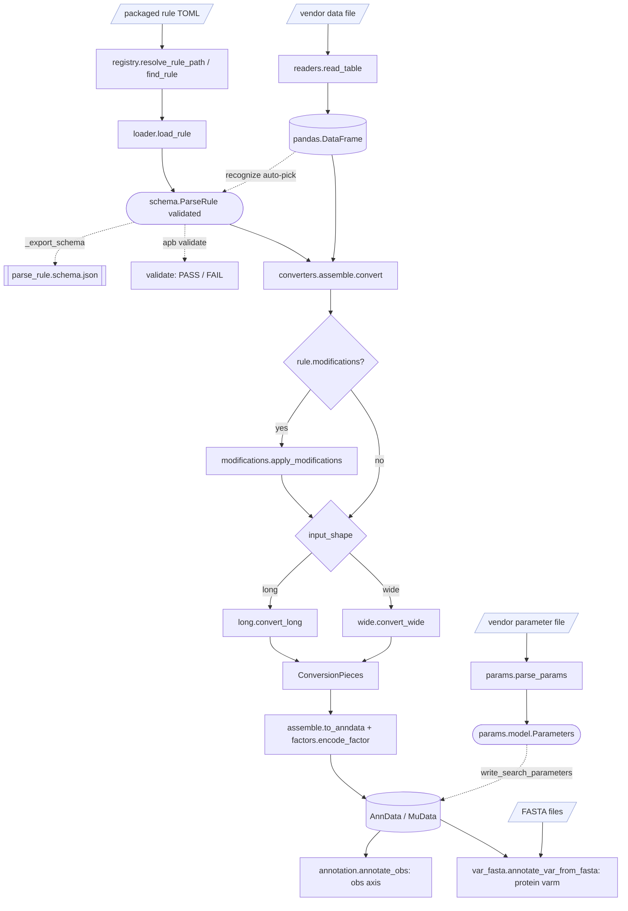

# Architecture (current state)

**Status as of 2026-06-26**. This document describes what is *implemented today*; remaining work is listed under [Not yet implemented](#not-yet-implemented) below.

## Data flow



For the detailed per-subsystem class and sequence diagrams, see [parsing_architecture.md](parsing_architecture.md); for the vendor parameter parsers see [parameter_parsers.md](parameter_parsers.md).

## Modules

### `rules/schema.py`

**Purpose** — pydantic models for the parsing-rule TOML format. Single source of truth for what a valid rule looks like; the JSON Schema is derived from these models.

**Public API**

- `ParseRule` — top-level container. Validates structure plus cross-field rules: long/wide layer consistency, `axis.x_layer` exists in `layers[*].name`, factor-encoded layers require non-empty `categories`, `sample_name_cleanup` only valid for wide rules, no unknown top-level keys (`extra='forbid'`).
- `Axis`, `Columns`, `Layer`, `Duplicates`, `SampleNameCleanup` — per-section sub-models, all strict.
- `InputShape`, `QuantificationLevel`, `EncodingMode`, `DuplicateMode` — `Literal` type aliases used as field types.

**Depends on** — `pydantic` only.

**Tests** — [tests/test_rule_models.py](../tests/test_rule_models.py)

### `rules/loader.py`

**Purpose** — read a TOML file and return a validated `ParseRule`.

**Public API**

- `load_rule(path) -> ParseRule` — `tomllib.loads` + `ParseRule.model_validate`. Raises `FileNotFoundError` on missing path; on pydantic `ValidationError`, attaches the file path as an exception note before re-raising.
- `load_packaged_rule(software, quantification_level, version=None) -> ParseRule` — sugar over `find_rule + load_rule`. `version=None` selects the version-agnostic vendor-root rule; pass a software version string to pick the matching `v*/` subfolder.

**Depends on** — `rules.schema`, `rules.registry`, stdlib `tomllib`.

**Tests** — [tests/test_rule_loader.py](../tests/test_rule_loader.py)

### `rules/registry.py`

**Purpose** — locate packaged TOMLs by `(software, level, version)` and enumerate them. Some vendors (notably DIA-NN) ship version-specific rules in `v*/` subfolders because their column sets change across releases; this module resolves a parsed software version to the most-specific covering folder.

**Public API**

- `packaged_rules_root() -> Path` — `parsing_rules/` inside the installed package, via `importlib.resources` (works for editable installs and wheels).
- `iter_packaged_rules() -> Iterator[Path]` — sorted glob of every packaged rule, covering both the flat `parsing_rules/<vendor>/parse_*.toml` and version-foldered `parsing_rules/<vendor>/v*/parse_*.toml` layouts.
- `resolve_rule_path(software, level, version=None) -> Path | None` — path to the rule for `(software, level)` at a given software version. Picks the most-specific `v*` subfolder whose version is a prefix of `version` and that contains `parse_<software>_<level>.toml`; otherwise the vendor-root file (or a legacy `parse_<software>_<level>_<n>.toml`). Returns `None` when nothing matches; `version=None` skips the folders and uses the root file only.
- `find_rule(software, level, version=None) -> Path` — `resolve_rule_path(...)` or raise `RuleNotFound`.
- `RuleNotFound(LookupError)` — raised by `find_rule` when `(software, level, version)` resolves to no packaged TOML.

**Depends on** — stdlib only (`importlib.resources`, `pathlib`).

**Tests** — [tests/test_rule_registry.py](../tests/test_rule_registry.py)

### `rules/validate.py`

**Purpose** — produce CLI-friendly batch validation results.

**Public API**

- `ValidationResult` — frozen dataclass `{path, ok, error, rule}`. `error` is a one-line summary string; `rule` is populated when `ok=True`.
- `validate_file(path) -> ValidationResult` — never raises; failures come back as `ok=False`.
- `validate_all_packaged() -> list[ValidationResult]` — walks every packaged rule.
- `_log_and_exit_code(results) -> int` — logs `PASS path` / `FAIL path: msg` per rule plus a summary line, returns 0 if all pass else 1. Driven by the `apb validate` subcommand (there is no separate `validate-rules` console script).

**Depends on** — `rules.loader`, `rules.registry`, `rules.schema`.

**Tests** — [tests/test_rule_validate.py](../tests/test_rule_validate.py)

### `rules/_export_schema.py`

**Purpose** — emit `parse_rule.schema.json` from `ParseRule.model_json_schema()` as a side-output for IDE tooling (Even Better TOML / taplo) and CI sanity checks.

**Public API**

- `main()` — invoked by the `apb export-schema` subcommand; writes to `parsing_rules/_schema/parse_rule.schema.json`.

**Depends on** — `rules.schema`, stdlib `json`.

**Tests** — covered indirectly by `test_rule_models.test_json_schema_export_has_expected_top_level_properties`. [tests/test_json_schema_validation.py](../tests/test_json_schema_validation.py) additionally round-trips every packaged TOML through `jsonschema.validate(...)` against the generated schema (structural-parity smoke test). Pydantic remains the only source of truth for cross-field rules — JSON Schema is strictly weaker, by design.

### `parsing_rules/`

**Purpose** — packaged vendor TOML rules, one folder per vendor, plus the generated JSON Schema under `_schema/`.

**Current contents**

```
parsing_rules/
├── _schema/parse_rule.schema.json                generated, IDE-consumed
├── diann/parse_diann_ion.toml                    long, ion
├── diann/v1/parse_diann_fragment.toml            long, fragment
├── diann/v1/parse_diann_protein.toml             long, protein
├── diann/v2/parse_diann_protein.toml             long, protein
├── spectronaut/parse_spectronaut_ion_1.toml      long, ion
├── spectronaut/parse_spectronaut_fragment.toml   long, fragment
├── spectronaut/parse_spectronaut_protein.toml    long, protein
├── maxquant/parse_maxquant_ion_1.toml            long, ion
├── fragpipe/parse_fragpipe_ion_1.toml            wide, ion
├── peaks/parse_peaks_ion_1.toml                  wide, ion
└── wombat/parse_wombat_peptidoform_1.toml        wide, peptidoform
```

| Vendor | Level | Shape |
|---|---|---|
| DIA-NN | ion | long |
| DIA-NN | fragment | long |
| DIA-NN | protein (v1, v2) | long |
| Spectronaut | ion / fragment / protein | long |
| MaxQuant | ion | long |
| FragPipe | ion | wide |
| PEAKS | ion | wide |
| WOMBAT | peptidoform | wide |

**Filename convention** — `parse_<software>_<level>.toml`. The level token must match the TOML's `quantification_level` field; [tests/test_packaged_rules.py](../tests/test_packaged_rules.py) enforces this. Version-specific rules (whose columns change across software releases) live in a `v*/` subfolder of the vendor — `diann/v1/`, `diann/v2/`, finer `diann/v1_9/` when needed — and `registry.resolve_rule_path` selects the most-specific folder covering a parsed software version; version-agnostic levels stay at the vendor root. A legacy `parse_<software>_<level>_<n>.toml` form is still recognised as a root-level fallback.

### `readers/tabular.py`

**Purpose** — generic per-extension readers; no vendor semantics, no rule application.

**Public API**

- `read_csv(path)` — comma-delimited, UTF-8 with BOM tolerance.
- `read_tsv(path)` — tab-delimited, UTF-8 with BOM tolerance.
- `read_parquet(path)` — via pyarrow.

Each is a thin wrapper around `pd.read_csv` / `pd.read_parquet` so the test suite has stable entry points and any future overrides land in one place.

**Depends on** — `pandas`, `pyarrow`.

**Tests** — [tests/test_readers_tabular.py](../tests/test_readers_tabular.py)

### `readers/dispatch.py`

**Purpose** — pick the right reader from a file's extension. Vendor differences across the 6 packaged TOMLs collapse to four extensions; this is the only piece of code that knows that.

**Public API**

- `read_table(path) -> pd.DataFrame` — dispatch by `path.suffix.lower()`.
- `EXTENSION_TO_READER` — registry mapping. `.txt` is treated as TSV (MaxQuant convention).
- `UnknownFormat(ValueError)` — raised when the extension is not registered.

**Depends on** — `readers.tabular`.

**Tests** — [tests/test_readers_dispatch.py](../tests/test_readers_dispatch.py); end-to-end coverage in [tests/test_readers_integration.py](../tests/test_readers_integration.py), which parametrizes over every packaged TOML and reads the matching test_data_download file (skips if the gitignored cache is absent).

## `scripts/cli.py` — `apb` umbrella CLI

**Purpose** — single user-facing CLI with subcommands. Built on `cyclopts`.

**Subcommands**

| Subcommand | Behavior | Exit code |
|---|---|---|
| `validate [path ...]` | Validate one or more TOML rules. With no path, walks all packaged rules. | 0 if all pass, 1 otherwise |
| `list` | List packaged rules: software, level, file_version, version pattern, path (read from each parsed rule, not the filename). | 0 |
| `export-schema` | Regenerate `parse_rule.schema.json`. | 0 |
| `convert <data> [level] [--params] [--rule-toml] [--software] [--output]` | Convert a vendor file to a multi-level **MuData** (`.h5mu`, default) or one `level` (ion/fragment/peptidoform/peptide/protein) to an **AnnData** (`.h5ad`). The vendor is auto-detected from headers (`--software` overrides); `--params` supplies the software version that selects the rule variant and is required unless `--rule-toml` is given. A single-level vendor writes `.h5ad` even with no level. Defaults output to `<stem>.h5mu` / `<stem>.h5ad`. | 0 on success, 1 on vendor/level/recognition failure |
| `annotate <data> <annotation-toml> [--output]` | Join the TOML's `obs.samples` table onto `obs` of an `.h5ad`/`.h5mu`; defaults output to `<stem>.annotated<suffix>`. | 0 on success |
| `fasta <data> <fasta ...> [--match-on] [--no-is-uniprot] [--decoy-pattern] [--cleavage] [--min-length] [--max-length] [--output]` | Attach FASTA-derived annotation (`fasta.id`, `fasta.header`, `protein_length`, `nr_peptides`, `gene_name`) to the **protein layer's** `varm['fasta']`. Joins on the leading accession of each protein group; defaults output to `<stem>.annotated<suffix>`. | 0 on success, 1 if no FASTA given |

**Implementation principle** — `validate` delegates to the shared PASS/FAIL formatter `rules.validate._log_and_exit_code`, so the output and exit code match `validate_all_packaged` called directly.

**Tests** — [tests/test_cli.py](../tests/test_cli.py)

## Console scripts

Wired in [pyproject.toml](../pyproject.toml) under `[project.scripts]`:

| Command | Module | Purpose |
|---|---|---|
| `apb` | `scripts.cli:main` | Umbrella CLI with `validate / list / export-schema / convert / annotate / fasta` subcommands |

`apb` is the only installed console script, and `scripts/` now holds only `cli.py` behind it. The param-driven conversion **core** that `apb convert` orchestrates lives in [`converters/pipeline.py`](../src/anndata_proteomics/converters/pipeline.py) (`recognize_software` → `_param_version` → `select_rule`/`convertible_levels` → `_convert_level`/`_build_mudata`); `readers/result.py` loads a written `.h5ad`/`.h5mu` back. The marimo GUI tools (test-data browser, AnnData viewer, background-job plumbing, ProteoBench catalog) were extracted to the sibling **`apb_studio`** package on 2026-06-28 — apb is a pure library + CLI with no marimo dependency, and apb_studio drives it via the `apb` CLI.

### `converters/recognize.py`

**Purpose** — match a DataFrame's column headers to one of the packaged `ParseRule`s.

**Public API**

- `matches(headers, rule) -> bool` — does this rule plausibly fit?
- `recognize(headers) -> ParseRule | None` — unique match, or None on zero / multiple.

**Tests** — [tests/test_recognize.py](../tests/test_recognize.py)

### `converters/long.py`

**Purpose** — apply a long-format `ParseRule` to a DataFrame: pivot to per-layer (obs × var) matrices.

**Public API**

- `convert_long(df, rule) -> ConversionPieces` — full pipeline (build obs/var, pivot every layer, factor-encode where needed). Honors `duplicates.mode`. Coerces non-factor layers via `pd.to_numeric(errors='coerce')` so vendor sentinels like `"-"` become NaN rather than blowing up the pivot.

**Tests** — [tests/test_converters_long.py](../tests/test_converters_long.py)

### `converters/wide.py`

**Purpose** — apply a wide-format `ParseRule` to a DataFrame: extract sample tokens from column headers via each layer's `source` regex, build per-layer matrices.

**Public API**

- `convert_wide(df, rule) -> ConversionPieces` — extracts samples (union across layers, insertion-order), builds var from materialized `[columns.var.select]` and `[[columns.var.compute]]` outputs, gathers each layer's matching columns into an `(n_obs × n_var)` matrix. Populates obs columns from `[columns.obs.select]`: each entry whose value is the `<sample>` placeholder becomes a column of sample tokens (so `sample = "<sample>"` produces an obs column named `sample`). Any non-placeholder value raises — wide rules have no per-row metadata to pull from. Applies `sample_name_cleanup.pattern` if present.

**Tests** — [tests/test_converters_wide.py](../tests/test_converters_wide.py)

### `converters/factors.py`

**Purpose** — encode string-valued layer data to integer codes per the TOML `categories` map.

**Public API**

- `encode_factor(series, categories, default=-1) -> Series[int64]` — unknowns and NaN → `default`.

**Tests** — [tests/test_converters_factors.py](../tests/test_converters_factors.py)

### `converters/assemble.py`

**Purpose** — assemble `ConversionPieces` into an `AnnData`, plus `convert(df, rule)` umbrella.

**Public API**

- `to_anndata(pieces, rule) -> ad.AnnData` — wraps the pieces; writes `uns['anndata_proteomics']` with `rule`, `schema_version`, `software_name`, `input_shape`, `quantification_level`.
- `convert(df, rule) -> ad.AnnData` — dispatches to `convert_long` or `convert_wide` based on `rule.input_shape`, then assembles.

**Tests** — [tests/test_converters_assemble.py](../tests/test_converters_assemble.py); end-to-end coverage for all 6 packaged vendors in [tests/test_converters_e2e.py](../tests/test_converters_e2e.py).

### `params/`

**Purpose** — parse a vendor **search-parameter file** (whole-experiment settings: enzyme, FDR, tolerances, modifications, …) into a single typed `Parameters` record, and attach/read it on an AnnData.

**Public API (summary)**

- Each vendor module exposes the same entry point `extract_params(source) -> Parameters` (`diann`, `maxquant`, `spectronaut`, `fragpipe`, `sage`, `alphapept`, `metamorpheus`, `msaid`, `peaks`, `wombat`).
- `params.registry.parse_params(path, software)` / `get_parser(software)` / `available_software()` — dispatch by software name.
- `params.model.Parameters` — the typed record; a validator **canonicalizes `enzyme`** to a fixed name set (`Trypsin`, `Trypsin/P`, `Lys-C`, `Arg-C`, `Glu-C`, `Chymotrypsin`, `Asp-N`), which is what the FASTA annotation reads to pick its cleavage rule.
- `params.anndata_io.read_search_parameters(adata)` / `write_search_parameters(adata, params, *, source_path=None)` — round-trip `Parameters` through `uns['anndata_proteomics']['search_parameters']` (JSON), with optional `search_parameters_path` provenance. `converters.convert` attaches them automatically when given a `params_path`.

**Detail** — full module-by-module breakdown and class/flow diagrams in [parameter_parsers.md](parameter_parsers.md) and [parsing_architecture.md](parsing_architecture.md).

### `modifications/`

**Purpose** — turn vendor **modified-sequence strings** into a normalised ProForma sequence plus modification models (for SDRF and downstream use).

**Public API (summary)**

- `modifications.pipeline.apply_modifications(df, rule.modifications)` — the converter-facing entry point; produces `proforma_sequence` and `stripped_sequence` columns from a rule's `[modifications]` section.
- `modifications.apply_rules.apply_rule(seq, rule)` — token extraction + mapping for a single sequence.
- `modifications.proforma.render_proforma(...)`, `modifications.sdrf.to_sdrf_value(mod)`, `modifications.unimod_registry.resolve(accession)`, and the `model.py` identity types (`SearchedModification`, `ModificationOccurrence`).

**Detail** — full module-by-module breakdown and class diagrams in [parsing_architecture.md](parsing_architecture.md).

### `fasta/`

**Purpose** — read FASTA file(s) into a prolfquapp-style protein-annotation DataFrame.

**Public API**

- `fasta.parser.iter_fasta(source) -> Iterator[FastaRecord]` — minimal reader over a path, stream, or raw FASTA text. No biology semantics.
- `fasta.annotation.fasta_to_dataframe(sources, *, decoy_pattern, is_uniprot, cleavage, min_length, max_length, include_sequence) -> DataFrame` — faithful port of prolfquapp's `get_annot_from_fasta()`: emits `fasta.id`, `fasta.header`, `proteinname`, `gene_name` (only when >1 record carries `GN=`), `protein_length`, `nr_peptides` (prolfquapp calls this `nr_tryptic_peptides`; renamed here since the count is enzyme-aware), optional `sequence`. Decoys matching `decoy_pattern` are dropped first.
- `count_peptides(seq, *, cleavage, min_length, max_length)` and `resolve_cleavage(spec) -> (CleavageRule, name)` — the peptide count is **enzyme-aware**, not hardcoded trypsin. `_CLEAVAGE_RULES` is keyed by the canonical enzyme names emitted by `params.model.Parameters.enzyme` (`Trypsin`, `Trypsin/P`, `Lys-C`, `Arg-C`, `Glu-C`, `Chymotrypsin`, `Asp-N`) so the two cannot drift; unknown / `None` falls back to trypsin. The column is named `nr_peptides` (enzyme-agnostic — the theoretical in-silico digest count, not trypsin-specific and not observed).

**Tests** — [tests/test_fasta_annotation.py](../tests/test_fasta_annotation.py)

### `annotation/`

**Purpose** — join an external table onto an AnnData/MuData axis.

**Public API**

- `annotation.apply.annotate_obs(obj, spec)` + `annotation.loader.load_annotation(path)` — **obs** axis: join an annotation TOML's `obs.samples` records onto the run/file axis (shared across MuData modalities). Provenance under `uns['anndata_proteomics']['obs_annotations_json']`.
- `annotation.var_fasta.annotate_var_from_fasta(obj, fasta_sources, *, match_on, is_uniprot, decoy_pattern, cleavage, min_length, max_length, include_sequence, columns)` — **var** axis, **protein layer only** (a protein-level AnnData, or the `protein` modality of a MuData; anything else raises). Builds the FASTA frame and attaches it as a var-aligned DataFrame at `varm['fasta']` (the namespace makes the FASTA origin — hence theoretical, not observed — self-evident, so columns keep bare prolfquapp names). The join is keyed on the leading accession of each protein group (prolfquapp's cleanID: first `;`-token, UniProt-middle-extracted) matched against `proteinname`. The cleavage rule / peptide-length bounds default to the enzyme stored under `uns['anndata_proteomics']['search_parameters']` (`params.anndata_io.read_search_parameters`), so the count reflects the actual digestion; `cleavage`/`min_length`/`max_length` override it. Mirrors `annotate_obs` semantics (raise on zero match or if `varm['fasta']` exists, warn on partial match). Provenance — including the enzyme used — under `uns['anndata_proteomics']['var_annotations_json']`.

**Tests** — [tests/test_annotation.py](../tests/test_annotation.py), [tests/test_annotation_var_fasta.py](../tests/test_annotation_var_fasta.py)

## R-side report package: `~/projects/anndata_bridge/annProtSum/`

Sibling R package (own folder, sibling of this repo, **not** under `tools/`). Renders HTML summary reports from `.h5ad` files via a parametrized Quarto vignette. Reads h5ad natively with `anndataR`.

The vignette `inst/quarto/report.qmd` is a thin tabset shell that calls helpers in `R/report_helpers.R`. The QMD renders self-contained (`embed-resources: true`) so a single `.html` opens correctly without a sibling `report_files/` directory. Outer tabs: **Overview | obs | var | X + layers | uns | obsm | varm**. The `X + layers` tab nests one sub-tab per layer (with `X` shown as `X (= <axis.x_layer>)`), or renders the single layer flat when only one is present.

- **obs panel** — `gt(obs)` table, `skimr::skim(obs)`, and `GGally::ggpairs(obs)` when `ncol(obs) ≥ 2 && nrow(obs) ≥ 2`. ggpairs auto-chooses the panel type per pair (numeric/categorical mix).
- **var panel** — single `GGally::ggpairs(var)` over a filtered subset. Cardinality filter: drop any column with `< 2` unique non-NA values; for character/factor/integer columns also drop those whose unique-count exceeds `max(2, nrow(var) %/% 1000)`. Surviving integer columns are coerced to factor so ggpairs draws bar/box panels for them (e.g. `Charge`) rather than treating them as continuous. Dropped column names are listed inline above the plot.
- **Per-layer (numeric) panels** — shape/dtype/NA/zero summary, per-run colour-coded density (one density line per run, log-x for quant-like layer names, linear otherwise), per-run boxplot, and a sample × sample correlation heatmap when `n_obs ≥ 2` (skipped at `n_obs == 1` because the correlation reduces to a 1×1 trivial value).
- **Per-layer (factor-encoded) panels** — for layers with `categories` populated in the rule (e.g. **FragPipe `Match_Type`**), the helper looks up the layer entry in `rule_json$layers` by scanning `$name` (parsed `layers` is an unnamed list of dicts, not name-indexed) and builds a code→label map from `categories` (which the TOML stores as `{label = code}`). Renders: `gt` table of the code/category mapping, **Counts per run** stacked bar (x = run, fill = decoded category, y = count), and **Proportion per run** (same bar with `position = "fill"`, easier to compare ratios across runs of different sizes). No density/boxplot/correlation — those are meaningless for integer-coded categoricals.
- **uns panel** — each top-level key pretty-printed as a YAML fenced block. `rule_json` is parsed from its JSON-string representation once in the setup chunk and written back to `adata$uns$anndata_proteomics$rule_json`, so every helper sees a list rather than a string.
- **obsm / varm** — summarise each key (shape + finite-value range); scatter the matrix when its name matches `^X_(pca|umap|tsne)` / `^X_(de|ptm)` and has 2 columns.

Implementation note for the `results = "asis"` chunks: each `print()` of a `gt` or `ggplot` is followed by a blank line via a tiny `.emit()` helper. Without that blank line Pandoc treats raw-HTML output (e.g. gt's `</div><!--/html_preserve-->`) as continuing through the next `####` heading, which was silently dropping inner-tab labels in earlier versions. The `inst/bin/render_report.R` script also `normalizePath()`s its temp dir before calling `quarto_render()` — on macOS, `tempfile()` returns `/var/folders/...` while Quarto's resource-cleanup compares realpaths (`/private/var/...`), and the mismatch otherwise aborts post-render with `Refusing to remove directory`.

Install (R):

```r
devtools::install("/Users/wolski/projects/anndata_bridge/annProtSum",
                  dependencies = TRUE)
```

Render a single .h5ad → .html from the shell:

```bash
Rscript $(R -q -s -e 'cat(system.file("bin/render_report.R", package = "annProtSum"))') \
        path/to/data.h5ad path/to/out.html
```

## Python orchestrator: `tools/generate_report.py`

Iterates **every packaged ParseRule** and produces a per-converter row in a single `index.html`. Per rule:

1. Look up a canonical input via `anndata_proteomics.test_data.find_test_data(rule.software_name)` — same lookup the integration tests use, against `test_data_download/raw_file_db_downloaded.csv`.
2. Read → convert → write `<stem>.h5ad` (+ sidecar `.meta.json` + `<stem>.log`).
3. Shell out to annProtSum's `render_report.R` to produce `<stem>.html`. The Rscript stdout/stderr is appended to the same per-rule `<stem>.log`.
4. Rows for converters with no available test data become `status=skipped`; failures become `status=failed`. Both still get a `.meta.json` and `.log`.

`<stem>` = `<software_token>_<sha8(input_path or software_name)>`.

```bash
python tools/generate_report.py
python tools/generate_report.py --output-dir examples/results
python tools/generate_report.py --rule WOMBAT --rule DIA-NN
python tools/generate_report.py --log-level DEBUG
```

A full run (no `--rule` filter) clears prior `*.meta.json / *.h5ad / *.html / *.log / index.html` in the output dir before iterating, so the index never mixes schemas.

`index.html` table columns: **software | input | input size | output (.h5ad) | .h5ad size | dim / layers | report | log**. Input and output cells render as basename-only `<a>` tags whose `title` attribute carries the full absolute path (so long paths don't blow out the column width but the tooltip still reveals them); size cells are formatted as `B`, `KiB`, `MiB`, or `GiB`; a small inline `<style>` block applies `vertical-align: top` and `word-break: break-word` so the layer list aligns cleanly when content does wrap.

## Logging convention

The package uses [`loguru`](https://github.com/Delgan/loguru) as its logging backbone. Library modules just `from loguru import logger` and emit messages; entry points (`scripts.cli:main`, `tools/generate_report.py:main`) call `anndata_proteomics._logging.configure_default_sink()` once to install a stderr sink with format `"{level} | {message}"`. Per-rule runs in `generate_report.py` add a scoped file sink (`<stem>.log`) for the duration of that rule.

Tests bridge loguru into pytest's `capsys` via [tests/conftest.py](../tests/conftest.py) — fixtures replace the sink with one whose writer looks up `sys.stderr` at write time, picking up pytest's per-test patched stream. CLI test assertions read `capsys.readouterr().err`.

## Not yet implemented

The first-pass restart goal (`vendor file + parsing TOML → AnnData`) is complete, and the package has since grown beyond it: vendor parameter parsing (`params/`), modified-sequence normalisation (`modifications/`), and second-stage obs/var annotation (`annotation/`, including FASTA-driven protein annotation). Remaining work:

- Per-tool `uns['<app_name>']['column_roles']` writeback per the [adr_tool_specific_views](../../anndata_omics_bridge/docs/adr_tool_specific_views.md) ADR (only `uns['anndata_proteomics']` is populated today). Once populated, the `uns` tab in the annProtSum report will surface them automatically (every top-level `uns` key gets a YAML block).
- `obs` enrichment from `sample_name_cleanup` regex capture groups.
- `duplicates.mode = "keep_all_as_raw_table"` (raises NotImplementedError; no current TOML uses it).

## Adding things

- **New vendor TOML** — drop a file at `parsing_rules/<software>/parse_<software>_<level>.toml` (or `parsing_rules/<software>/v<N>/parse_<software>_<level>.toml` for a version-specific rule). `apb validate` and the test suite pick it up automatically; no registry edits needed. The level in the filename must match the TOML's `quantification_level`.
- **New schema field** — edit [rules/schema.py](../src/anndata_proteomics/rules/schema.py), update the fixtures in [tests/test_rule_models.py](../tests/test_rule_models.py) and [docs/toml_schema.md](toml_schema.md), then run `apb export-schema` to regenerate the JSON Schema.
- **New `quantification_level` value** (e.g. `protein`) — already in the `QuantificationLevel` literal; just author the TOMLs and matching tests.
