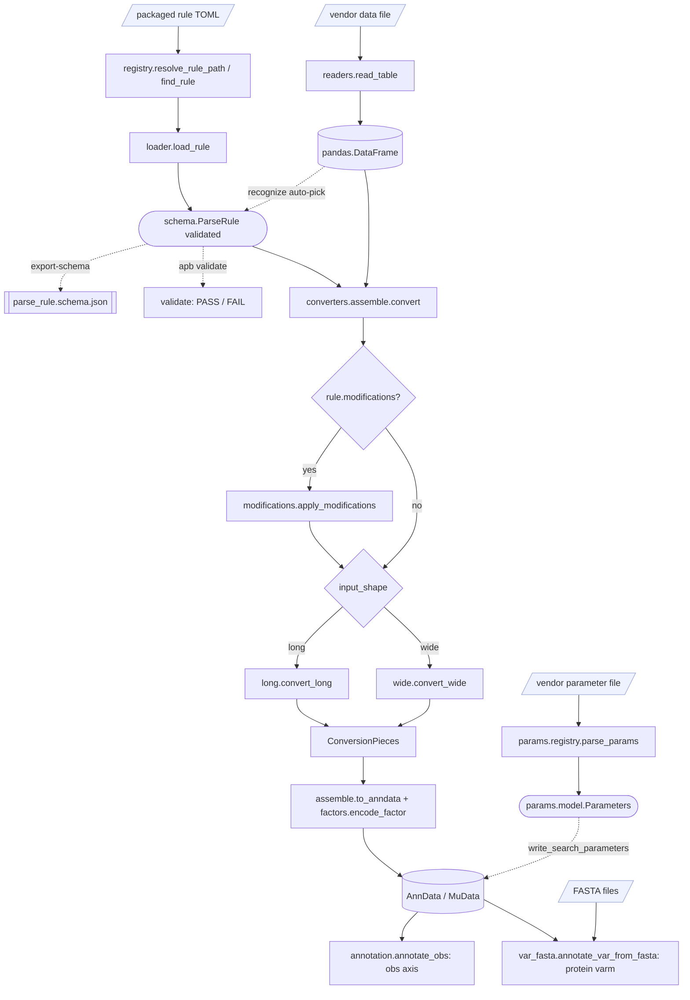

# Architecture

APB is a Python library plus the `apb` CLI. It converts proteomics vendor tables
to AnnData or MuData using packaged TOML parsing rules, and can attach search
parameters and external annotations.

## Data Flow

**Figure:** the main conversion path. Rule TOMLs are validated into `ParseRule`
objects; vendor data becomes a `DataFrame`; optional parameter files and FASTA
annotation enrich the final AnnData/MuData object.


```mermaid
flowchart TD
    toml[/packaged rule TOML/] --> resolve[registry.resolve_rule_path / find_rule]
    resolve --> load[loader.load_rule]
    load --> rule([schema.ParseRule validated])
    rule -. export-schema .-> schemajson[[parse_rule.schema.json]]
    rule -. apb validate .-> val[validate: PASS / FAIL]

    data[/vendor data file/] --> readtable[readers.read_table]
    readtable --> df[(pandas.DataFrame)]
    df -. recognize auto-pick .-> rule

    df --> convert[converters.assemble.convert]
    rule --> convert
    convert --> mods{rule.modifications?}
    mods -->|yes| applymods[modifications.apply_modifications]
    mods -->|no| shape{input_shape}
    applymods --> shape
    shape -->|long| long[long.convert_long]
    shape -->|wide| wide[wide.convert_wide]
    long --> pieces[ConversionPieces]
    wide --> pieces
    pieces --> assemble[assemble.to_anndata + factors.encode_factor]
    assemble --> adata[(AnnData / MuData)]

    paramfile[/vendor parameter file/] --> parseparams[params.registry.parse_params]
    parseparams --> params([params.model.Parameters])
    params -. write_search_parameters .-> adata

    adata --> annobs[annotation.annotate_obs: obs axis]
    fastafile[/FASTA files/] --> annvar[var_fasta.annotate_var_from_fasta: protein varm]
    adata --> annvar

    classDef io fill:#eef2ff,stroke:#9aa7d8;
    class toml,data,paramfile,fastafile io;
```

More detailed diagrams are in [parsing_architecture.md](parsing_architecture.md).
Search-parameter parser details are in [parameter_parsers.md](parameter_parsers.md).

## Package Map

| Area | Current role |
|---|---|
| `rules/` | Pydantic schema, loader, registry, validator, and JSON Schema export for rule TOMLs. |
| `parsing_rules/` | Packaged TOMLs under `src/anndata_proteomics/parsing_rules/`. |
| `readers/` | File-extension dispatch to CSV, TSV/TXT, and Parquet readers. |
| `converters/` | Rule-driven long/wide conversion into AnnData; multi-level CLI conversion can assemble MuData. |
| `modifications/` | Vendor modified-sequence normalization to ProForma and searched-modification models. |
| `params/` | Typed search-parameter model, parser registry, AnnData storage helpers, and vendor parsers under `params/parsers/`. |
| `annotation/` | `obs` table annotation plus FASTA-derived protein `varm['fasta']` annotation. |
| `fasta/` | FASTA parsing, protein metadata extraction, and enzyme-aware theoretical peptide counts. |
| `scripts/` | The installed `apb` CLI. |

## Packaged Rules

Packaged rule files live inside the Python package:

```text
src/anndata_proteomics/parsing_rules/
  _schema/parse_rule.schema.json
  diann/parse_diann_ion.toml
  diann/v1/parse_diann_fragment.toml
  diann/v1/parse_diann_protein.toml
  diann/v2/parse_diann_protein.toml
  fragpipe/parse_fragpipe_ion_1.toml
  maxquant/parse_maxquant_ion_1.toml
  peaks/parse_peaks_ion_1.toml
  spectronaut/parse_spectronaut_ion_1.toml
  spectronaut/parse_spectronaut_fragment.toml
  spectronaut/parse_spectronaut_protein.toml
  wombat/parse_wombat_peptidoform_1.toml
```

`rules.registry.resolve_rule_path()` selects a version-specific rule when a
matching `v*/` folder exists, otherwise it falls back to the vendor-root rule.

## CLI Surface

`pyproject.toml` installs one console script:

```bash
apb
```

The CLI subcommands are:

| Subcommand | Purpose |
|---|---|
| `apb validate [path ...]` | Validate rule TOMLs; with no paths, validate all packaged rules. |
| `apb list` | List packaged rules and their metadata. |
| `apb export-schema` | Regenerate `parse_rule.schema.json`. |
| `apb convert <data> [level] --params <param-file>` | Convert vendor data to `.h5mu` or a selected `.h5ad` level. |
| `apb annotate <data> <annotation.toml>` | Join external sample metadata onto `obs`. |
| `apb fasta <data> <proteome.fasta>` | Attach FASTA-derived protein metadata to the protein layer. |

## Search Parameters

Generic code stays at `params/`:

```text
params/
  anndata_io.py
  model.py
  registry.py
  parsers/
```

Vendor-specific parser implementations live only under `params/parsers/`.
Every parser exposes `extract_params(source) -> Parameters`; `params.registry`
dispatches by software name.

## Optional Report Helper

`tools/generate_report.py` is a development helper. It iterates packaged rules,
converts one canonical test-data input per rule, and writes an HTML index for
review. Any external report renderer is outside APB. Generated `.h5ad`,
`.html`, `.log`, `.meta.json`, and `index.html` outputs are build artifacts
and must stay out of git.

## Current Limits

- Conversion coverage is limited to the packaged vendor/level rules above.
- `apb fasta` annotates a protein AnnData or the `protein` modality of a MuData.
- `duplicates.mode = "keep_all_as_raw_table"` is reserved but not implemented.
- Per-tool `uns['<app_name>']['column_roles']` writeback is not populated yet;
  APB writes `uns['anndata_proteomics']`.

## Adding Things

- New vendor table rule: add a TOML under
  `src/anndata_proteomics/parsing_rules/<software>/`, then run `apb validate`.
- New vendor parameter parser: add `params/parsers/<vendor>.py`, register it in
  `params/registry.py`, and add parser fixtures/tests.
- New schema field: edit `rules/schema.py`, update tests and
  [toml_schema.md](toml_schema.md), then run `apb export-schema`.
