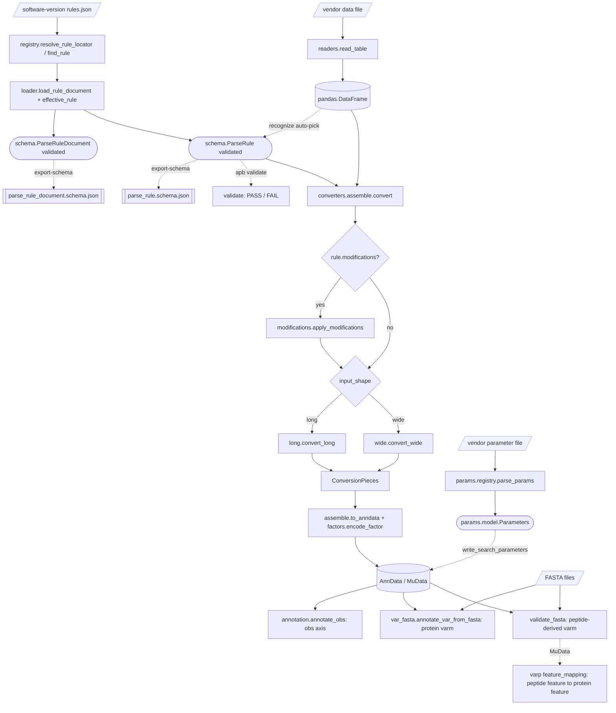

# Architecture

APB is a Python library plus the `apb` CLI. It converts proteomics vendor tables
to AnnData or MuData using packaged JSON parsing rules, and can attach search
parameters and external annotations.

## Data Flow

**Figure:** the main conversion path. Rule JSON documents are validated into `ParseRule`
objects; vendor data becomes a `DataFrame`; optional parameter files and FASTA
annotation and peptide validation enrich the final AnnData/MuData object.


```mermaid
flowchart TD
    config[/software-version rules.json/] --> resolve[registry.resolve_rule_locator / find_rule]
    resolve --> load[loader.load_rule_document + effective_rule]
    load --> source([schema.ParseRuleDocument validated])
    load --> rule([schema.ParseRule validated])
    source -. export-schema .-> sourceschema[[parse_rule_document.schema.json]]
    rule -. export-schema .-> schemajson[[parse_rule.schema.json]]
    rule -. apb validate .-> val[validate: PASS / FAIL]

    data[/vendor data file/] --> readtable[readers.read_table]
    readtable --> df[(pandas.DataFrame)]
    df -. recognize auto-pick .-> rule

    df --> convert[converters.assemble.convert]
    rule --> convert
    convert --> mods{rule.modifications?}
    mods -->|yes| applymods[modifications.apply_modifications]
    mods -->|no| shape{input_shape}
    applymods --> shape
    shape -->|long| long[long.convert_long]
    shape -->|wide| wide[wide.convert_wide]
    long --> pieces[ConversionPieces]
    wide --> pieces
    pieces --> assemble[assemble.to_anndata + factors.encode_factor]
    assemble --> adata[(AnnData / MuData)]

    paramfile[/vendor parameter file/] --> parseparams[params.registry.parse_params]
    parseparams --> params([params.model.Parameters])
    params -. write_search_parameters .-> adata

    adata --> annobs[annotation.annotate_obs: obs axis]
    fastafile[/FASTA files/] --> annvar[var_fasta.annotate_var_from_fasta: protein varm]
    adata --> annvar
    fastafile --> valfasta[validate_fasta: peptide-derived varm]
    adata --> valfasta
    valfasta -. MuData .-> mulink[varp feature_mapping: peptide feature to protein feature]

    classDef io fill:#eef2ff,stroke:#9aa7d8;
    class config,data,paramfile,fastafile io;
```

More detailed diagrams are in [parsing_architecture.md](parsing_architecture.md).
Search-parameter parser details are in [parameter_parsers.md](parameter_parsers.md).

## Package Map

| Area | Current role |
|---|---|
| `rules/` | Pydantic source/effective schemas, document merge loader, registry, validator, and JSON Schema export. |
| `parsing_rules/` | Packaged JSON rules under `src/anndata_proteomics/parsing_rules/`. |
| `readers/` | File-extension dispatch to CSV, TSV/TXT, and Parquet readers. |
| `converters/` | Rule-driven long/wide conversion into AnnData; multi-level CLI conversion can assemble MuData. |
| `modifications/` | Vendor modified-sequence normalization to ProForma and searched-modification models. |
| `params/` | Typed search-parameter model, parser registry, AnnData storage helpers, and vendor parsers under `params/parsers/`. |
| `annotation/` | `obs` annotation, FASTA-derived protein `varm['fasta']`, peptide `varm['fasta_validation']`, and MuLink-compatible `varp['feature_mapping']`. |
| `fasta/` | FASTA parsing, typed decoy/contaminant configuration, protein metadata, and enzyme-aware theoretical peptide counts. |
| `prozor` dependency | Backend-neutral Aho--Corasick matching and reusable protein-inference primitives; APB owns FASTA parsing and AnnData/MuData storage. |
| `scripts/` | The installed `apb` CLI. |

## Packaged Rules

Packaged rule files live inside the Python package:

```text
src/anndata_proteomics/parsing_rules/
  _schema/parse_rule.schema.json
  _schema/parse_rule_document.schema.json
  diann/v1/rules.json        # ion, fragment, protein
  diann/v2/rules.json        # ion, protein
  fragpipe/rules.json        # ion
  maxquant/rules.json        # ion
  peaks/rules.json           # ion
  spectronaut/rules.json     # ion, fragment, protein
  wombat/rules.json          # peptidoform
```

`rules.registry.resolve_rule_locator()` selects a software-version document by its
required regex and addresses a level inside it. Vendor-root and `v*/` documents use
the same source shape.

## CLI Surface

`pyproject.toml` installs one console script:

```bash
apb
```

The CLI subcommands are:

| Subcommand | Purpose |
|---|---|
| `apb validate [path ...]` | Validate rule JSON; with no paths, validate all packaged rules. |
| `apb list` | List packaged rules and their metadata. |
| `apb export-schema` | Regenerate the source-document and effective-rule schemas. |
| `apb convert <data> [level] --params <param-file>` | Convert vendor data to `.h5mu` or a selected `.h5ad` level. |
| `apb annotate <data> <annotations.toml/csv/tsv>` | Join external sample metadata onto `obs`. |
| `apb fasta <data> <proteome.fasta>` | Annotate proteins and, by default, validate every peptide-derived modality against FASTA. |

## Search Parameters

Generic code stays at `params/`:

```text
params/
  anndata_io.py
  model.py
  registry.py
  parsers/
```

Vendor-specific parser implementations live only under `params/parsers/`.
Every parser exposes `extract_params(source) -> Parameters`; `params.registry`
dispatches by software name.

## Current Limits

- Conversion coverage is limited to the packaged vendor/level rules above.
- MuLink edges can only target protein features already present in a MuData;
  exhaustive FASTA matches remain available in each peptide modality's validation table.
- `duplicates.mode = "keep_all_as_raw_table"` is reserved but not implemented.
- Per-tool `uns['<app_name>']['column_roles']` writeback is not populated yet;
  APB writes `uns['anndata_proteomics']`.

## Adding Things

- New vendor table rule: add JSON under
  `src/anndata_proteomics/parsing_rules/<software>/`, then run `apb validate`.
- New vendor parameter parser: add `params/parsers/<vendor>.py`, register it in
  `params/registry.py`, and add parser fixtures/tests.
- New schema field: edit `rules/schema.py`, update tests and
  [json_schema.md](json_schema.md), then run `apb export-schema`.
