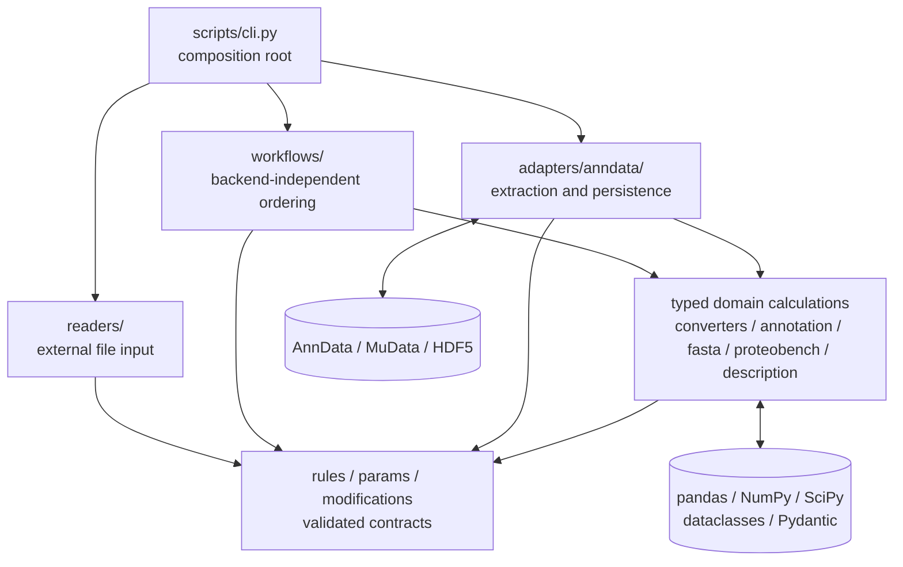

# Architecture

APB is a Python library plus the `apb` CLI. It converts proteomics vendor tables
with packaged parsing rules, calculates enrichments over typed pandas/NumPy/SciPy
values, and persists results to AnnData or MuData through a concrete storage adapter.

## Guiding Principle

> A function does one thing. Its signature contains exactly the data required to do
> that thing. If some behavior requires different data or performs another operation,
> it is a different function.

AnnData and MuData are storage backends, not APB's computational model. Scientific
functions therefore receive values such as `DataFrame`, `Series`, `Index`,
`QuantMatrix`, and small typed configuration/result records. They do not receive a
container merely to find those values themselves.

APB deliberately has no `AnnDataLike`, `Container`, repository, service locator, or
application-wide backend object. Such a facade would reproduce the AnnData API and
couple every computation to it under another name. Small dataclasses carry one
workflow invariant; they do not expose a growing service API.

## Dependency Direction

The CLI is the composition root. Conversion, sample annotation, FASTA, and
ProteoBench use backend-independent workflows to order pure calculations while the
AnnData adapter extracts and persists concrete values.


```mermaid
flowchart TD
    cli[scripts/cli.py<br/>composition root]
    reader[readers/<br/>external file input]
    adapter[adapters/anndata/<br/>extraction and persistence]
    workflows[workflows/<br/>backend-independent ordering]
    domain[typed domain calculations<br/>converters / annotation / fasta / proteobench / description]
    contracts[rules / params / modifications<br/>validated contracts]
    backend[(AnnData / MuData / HDF5)]
    values[(pandas / NumPy / SciPy<br/>dataclasses / Pydantic)]

    cli --> reader
    cli --> workflows
    cli --> adapter
    reader --> contracts
    workflows --> domain
    workflows --> contracts
    adapter --> domain
    adapter --> contracts
    adapter <--> backend
    domain <--> values
    domain --> contracts
```

The direction is inward: domain calculations and workflows never import the storage
adapter. Concrete `anndata`/`mudata` imports are confined to `adapters/anndata/` and
the CLI composition boundary. `readers.summary` is a file-oriented entry point that
delegates HDF5 extraction to `adapters/anndata/summary_hdf5.py` before calling the
backend-neutral description calculation.

Dependency injection is intentionally minimal. The completed workflow slices have the
composition root extract typed values, pass those values to a workflow, and pass the
typed result to persistence:

```python
frames = annotation_adapter.read_observation_frames(container)
result = run_sample_annotation(frames, annotation, origin)
annotation_adapter.write_sample_annotation(container, result)
```

A future backend supplies different extraction and persistence composition. It does
not imitate `.X`, `.obs`, `.var`, `.uns`, `.varm`, or `.mod`, and it does not require
changes to the calculation.

## Data Flow

The main implemented flows share the same boundary shape:

```mermaid
flowchart TD
    rulejson[/rules.json/] --> ruleload[rules.loader<br/>typed fragment composition]
    ruleload --> rule[ParseRule / RuleSelection]
    paramsfile[/vendor parameter file/] --> parseparams[params.registry.parse_params]
    parseparams --> resolution[ParameterResolution]
    resolution --> selection[typed version/parameter/column selection]
    rule --> selection

    vendor[/vendor quantification file/] --> tabular[readers.read_table]
    tabular --> frame[(pandas.DataFrame)]
    frame --> conversion[workflows.conversion]
    selection --> conversion
    conversion --> tablecalc[converters.assemble.convert_table]
    tablecalc --> pieces[ConversionPieces]
    pieces --> conversionadapter[adapters.anndata.conversion]
    conversionadapter --> container[(AnnData / MuData)]
    resolution -. parameters + provenance .-> conversionadapter

    annotationfile[/sample annotation/] --> annotationload[annotation.loader]
    container --> annotationadapter[adapters.anndata.annotation<br/>extract obs frames]
    annotationload --> annotationworkflow[workflows.sample_annotation]
    annotationadapter --> annotationworkflow
    annotationworkflow --> annotationcalc[annotation.sample]
    annotationcalc --> annotationresult[SampleAnnotationResult]
    annotationresult --> annotationadapter

    fastafile[/FASTA source(s)/] --> fastaworkflow[workflows.fasta<br/>shared scan and MuLink orchestration]
    container --> fastaadapter[adapters.anndata.fasta<br/>resolve roles and extract inputs]
    fastaadapter --> fastaworkflow
    fastaworkflow --> fastacalc[annotation.validate_fasta / var_fasta<br/>fasta parsing and matching]
    fastacalc --> fastaresult[typed FASTA results]
    fastaresult --> fastaadapter

    moduletoml[/ProteoBench module TOML/] --> pbworkflow[workflows.proteobench<br/>level orchestration]
    container --> pbadapter[adapters.anndata.proteobench<br/>extract matrix/design/roles]
    pbadapter --> pbworkflow
    pbworkflow --> pbcalc[proteobench.pipeline.score_level]
    pbcalc --> pbresult[ProteoBenchResult]
    pbresult --> pbadapter

    classDef io fill:#eef2ff,stroke:#9aa7d8;
    class rulejson,paramsfile,vendor,annotationfile,fastafile,moduletoml io;
```

Conversion produces backend-neutral `ConversionPieces`. Sample annotation produces
new observation frames and typed provenance. FASTA calculations return aligned
annotation/validation results and sparse feature mappings. ProteoBench returns typed
intermediates and a versioned `ProteoBenchScores` model. Only adapter code mutates
container slots.

More detailed parsing diagrams are in
[parsing_architecture.md](parsing_architecture.md). Search-parameter parser details are
in [parameter_parsers.md](parameter_parsers.md).

## Package Map

| Area | Role |
|---|---|
| `rules/` | Pydantic source/effective rule contracts, typed fragment composition, registry, validator, and JSON Schema export. |
| `parsing_rules/` | Packaged JSON rules under `src/anndata_proteomics/parsing_rules/`. |
| `params/` | Typed search-parameter models, parser registry, and vendor parsers; it contains no container storage code. |
| `modifications/` | Vendor sequence normalization, ProForma construction, and searched-modification contracts. |
| `readers/` | External tabular input and file-oriented summary composition. |
| `converters/` | Rule selection and vendor table conversion into `ConversionPieces`; no AnnData/MuData construction. |
| `annotation/` | Pure sample matching, protein FASTA annotation, peptide validation, and MuLink edge calculations. |
| `fasta/` | Pure FASTA parsing, typed decoy/contaminant configuration, digestion, and protein metadata. |
| `proteobench/` | Typed module settings, run alignment, matrix-native intermediates, and versioned score calculations. |
| `description.py` | Backend-neutral descriptions calculated from small extracted metadata records. |
| `workflows/` | Backend-independent conversion, sample-annotation, FASTA/MuLink, and ProteoBench orchestration. |
| `adapters/anndata/` | AnnData/MuData/HDF5 extraction, target iteration, namespace persistence, and result storage. |
| `scripts/` | Cyclopts CLI and composition root. |
| `prozor` dependency | Backend-neutral peptide matching and protein-inference primitives; APB owns FASTA parsing and storage. |

The core rule contracts retain the tested dependency direction
`rules → params → modifications`: rules use parsed parameter conditions, parameters
reuse canonical modification identities, and modifications do not import either
higher layer. Empty package initializers keep dependency edges explicit.

## Boundary Contracts

The main backend-neutral contracts are deliberately small:

- `ConversionPieces` and `LevelConversion` carry converted axes, matrices, and the
  rule selection that produced one level.
- `AnnotatedObservations`, `AnnotationDiagnostics`, and
  `SampleAnnotationProvenance` separate calculation from `obs` persistence.
- `FastaValidationResult`, `ProteinFastaAnnotationResult`, and
  `FeatureMappingResult` contain calculation output without container references.
- `QuantMatrix` is an explicit float32/float64 dense or CSR/CSC sparse union.
- `ProteoBenchResult` combines a typed intermediate with versioned
  `ProteoBenchScores`.
- `AnnDataDescriptionSource`, `MuDataDescriptionSource`, and `DescriptionMetadata`
  carry exact validated description inputs; the generic storage namespace is narrowed
  in the adapter before calculation.

Expected absence uses a domain result or an explicit `has_*()` check. A caller that
requires stored metadata uses `require_*()` and receives a concrete value or a precise
exception. There are no optional compatibility readers for unreleased formats.

Architectural tests enforce the boundary: computation/workflow modules cannot import
AnnData or MuData, workflows cannot access container slots, calculation signatures
cannot contain `Any`, explicit optional unions, or generic object property bags,
production code contains no `Any`, `noqa`, type-ignore suppression, or broad exception
handler, and backend imports are restricted to the adapter and CLI.

## Packaged Rules

Packaged rule files live inside the Python package:

```text
src/anndata_proteomics/parsing_rules/
  _schema/parse_rule.schema.json
  _schema/parse_rule_document.schema.json
  alphapept/rules.json       # ion
  diann/v1/rules.json        # ion, fragment, protein
  diann/v2/rules.json        # ion, protein
  fragpipe/rules.json        # ion
  maxquant/rules.json        # ion
  peaks/rules.json           # ion
  sage/rules.json            # ion, peptidoform (parameter-gated)
  spectronaut/rules.json     # ion, fragment, protein
  wombat/rules.json          # ion, peptidoform
```

`rules.loader.resolve_rule_locator_for_version()` and
`resolve_rule_locator_without_version()` express versioned and versionless lookup as
different operations and return precise unavailable/ambiguous results.
`ParseRuleDocument` composes its validated base, level, and search-parameter override
models directly; it does not deep-merge generic object payloads.

## CLI Surface

`pyproject.toml` installs one console script, `apb`, with these subcommands:

| Subcommand | Purpose |
|---|---|
| `apb validate [path ...]` | Validate rule JSON; with no paths, validate all packaged rules. |
| `apb list` | List packaged rules and their metadata. |
| `apb export-schema` | Regenerate source-document and effective-rule schemas. |
| `apb convert <data> [level] --params <param-file>` | Convert vendor data to `.h5mu` or a selected `.h5ad` level. |
| `apb annotate <data> <annotations.toml/csv/tsv>` | Join external sample metadata onto `obs`. |
| `apb fasta <data> <proteome.fasta>` | Annotate proteins and validate peptide-derived modalities against FASTA. |
| `apb proteobench <data> <module.toml>` | Score every supported level and store its intermediate and scores. |

## Search Parameters

Generic parsing code stays under `params/`:

```text
params/
  model.py
  registry.py
  parsers/
```

Vendor parser implementations live only under `params/parsers/`. Their native
`extract_params(...)` signatures may express vendor-specific inputs. The registry
dispatches by software name through typed source records; it does not guess companion
filenames. Concrete JSON persistence under
`uns["anndata_proteomics"]["search_parameters"]` belongs to
`adapters/anndata/params.py`.

## Current Limits

- Conversion coverage is limited to the packaged vendor/level rules above.
- MuLink edges can only target protein features already present in a MuData;
  exhaustive FASTA matches remain available in each peptide modality's validation
  table.
- `duplicates.mode = "keep_all_as_raw_table"` is reserved but not implemented.
- ProteoBench coverage currently implements the quantitative HYE metrics; PYE/plasma,
  de-novo, and entrapment variants are not implemented.
- Scoring is level-agnostic, but only ion and peptidoform have published ProteoBench
  modules. Other level scores are comparable across APB runs, not to the leaderboard.
- The generic APB QC engine and pMultiQC consumer described in
  `../TODO/TODO_pmultiqc_support.md` are planned but not implemented.

## Adding Things

- New vendor table rule: add JSON under
  `src/anndata_proteomics/parsing_rules/<software>/`, then run `apb validate`.
- New vendor parameter parser: add `params/parsers/<vendor>.py`, register it in
  `params/registry.py`, and add parser fixtures/tests.
- New calculation: derive a signature from the exact pandas/NumPy/SciPy values it
  needs, return a typed result, and add adapter extraction/persistence only if storage
  is required.
- New storage backend: compose backend-specific extraction and persistence around the
  existing workflows and calculations; do not add a universal container interface.
- New schema field: edit `rules/schema.py`, update tests and
  [json_schema.md](json_schema.md), then run `apb export-schema`.
