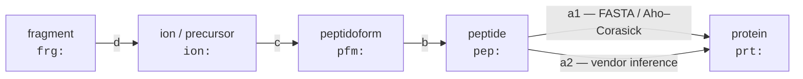
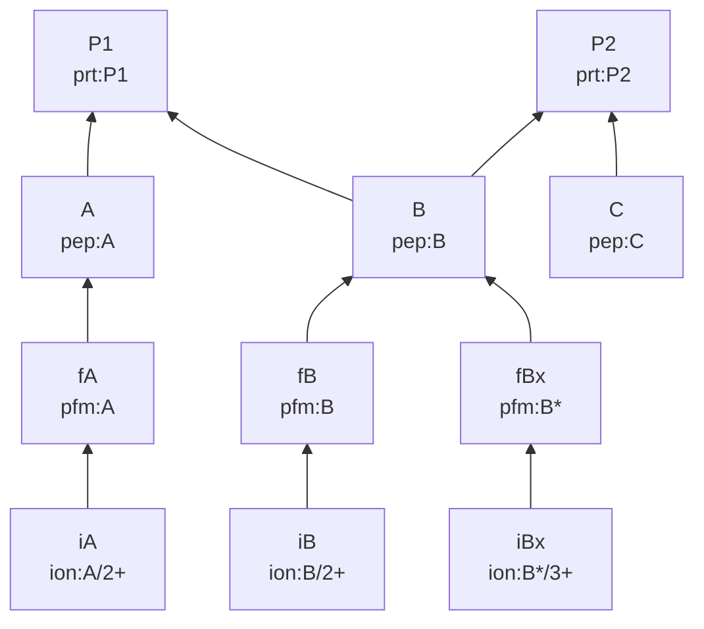
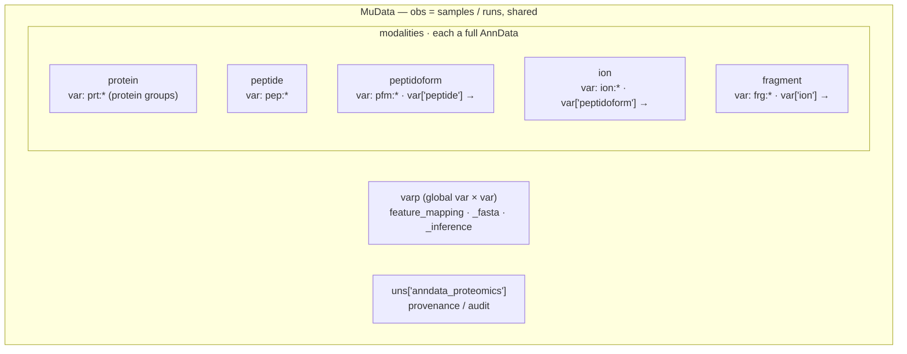

# Feature mapping — proteomics hierarchies in MuData `varp`

Proteomics features form a **hierarchy across modalities**: a fragment belongs to an
ion, an ion to a peptidoform, a peptidoform to a peptide, a peptide to one or more
proteins. APB stores each level as its own `AnnData` modality inside a `MuData`. This
page explains **how the links between levels are modelled**, works through a concrete
example, and states **where APB stores each mapping** and why.

The storage model is deliberately the one [`mulink`](https://github.com/lucas-diedrich/mulink)
reads: a square sparse adjacency matrix in `MuData.varp`. APB emits this today for the
peptide→protein layer ([`annotation/validate_fasta.py`](https://github.com/anndata-omics-bridge/anndata-proteomics-bridge/blob/main/src/anndata_proteomics/annotation/validate_fasta.py)),
so a `mulink`-decorated `MuData` "just works" with no translation layer.

---

## The levels and the four mappings

APB's levels, from coarse to fine, with their global `var_names` prefix:

| Level | Prefix | One feature is… |
|-------|--------|-----------------|
| protein | `prt:` | a protein / protein group |
| peptide | `pep:` | a stripped (unmodified) sequence |
| peptidoform | `pfm:` | a sequence + a specific modification state (ProForma) |
| ion / precursor | `ion:` | a peptidoform + a charge state |
| fragment | `frg:` | a fragment ion of a precursor |

The relationships the user asked about:



| Edge | From → To | Nature | Source |
|------|-----------|--------|--------|
| **a1** | peptide → protein | **M:N**, non-deterministic | Exact FASTA substring matching, Aho–Corasick (`prozor`) |
| **a2** | peptide → protein group | **M:N**, non-deterministic | vendor protein inference (DIA-NN / Spectronaut report) |
| **b** | peptidoform → peptide | **N:1**, deterministic | strip modifications |
| **c** | ion → peptidoform | **N:1**, deterministic | drop charge state |
| *d* | fragment → ion | **N:1**, deterministic | vendor fragment table |

Two things to notice, because they decide the storage design:

1. **a1 and a2 both map peptide→protein but they disagree.** Aho–Corasick returns
   *every* protein whose sequence contains the peptide; vendor inference returns the
   *parsimonious, reported* assignment. Keeping only one loses information — so
   provenance must be representable.
2. **b, c, d are deterministic and N:1.** Each ion has exactly one peptidoform; each
   peptidoform strips to exactly one peptide. These are naturally *columns*, not a
   matrix.

The hierarchy above is the target conceptual model. The current FASTA validator
does not invent missing intermediate modalities: it directly links every validated
peptide-derived feature row (peptide, peptidoform, ion, or fragment) to each existing
protein feature whose FASTA sequence contains its `ProForma_peptide`.

---

## The mulink model: one square matrix on the `MuData`

`mulink` stores links in **`mdata.varp["feature_mapping"]`** — a single
`(N × N)` `scipy.sparse.csr_matrix`, where `N` is the total number of features across
**all** modalities and the index is the concatenated global `var_names`. Its entire
write API is one line:

```python
# mulink/basic.py
def add_link(self, link, *, key="feature_mapping"):
    self._obj.varp[key] = csr_matrix(link)
```

A **non-zero entry `(u, v)` is a directed edge `u → v`**. Values are integers; `mulink`
only tests *non-zero-ness*, so a plain `1` (APB uses `int8`) means "there is a link".
`query.descendants(f)` reads the columns of row `f`; `query.ancestors(f)` reads the rows
of column `f` (single hop only).

Because features from different levels share one square axis, the matrix is
**block-structured** — only *adjacent-level* off-diagonal blocks are populated; the
diagonal and non-adjacent blocks are empty. This is the "huge sparse matrix" from the
question:

<div markdown="0" style="overflow-x:auto">
<table style="border-collapse:collapse;font-size:0.8rem;text-align:center">
  <tr>
    <th style="padding:4px 8px"></th>
    <th style="padding:4px 8px">→ prt</th>
    <th style="padding:4px 8px">→ pep</th>
    <th style="padding:4px 8px">→ pfm</th>
    <th style="padding:4px 8px">→ ion</th>
    <th style="padding:4px 8px">→ frg</th>
  </tr>
  <tr>
    <th style="padding:4px 8px;text-align:right">prt →</th>
    <td style="border:1px solid rgba(128,128,128,.3)">·</td>
    <td style="border:1px solid rgba(128,128,128,.3)">·</td>
    <td style="border:1px solid rgba(128,128,128,.3)">·</td>
    <td style="border:1px solid rgba(128,128,128,.3)">·</td>
    <td style="border:1px solid rgba(128,128,128,.3)">·</td>
  </tr>
  <tr>
    <th style="padding:4px 8px;text-align:right">pep →</th>
    <td style="border:1px solid rgba(128,128,128,.3);background:#f59e0b;color:#000;font-weight:600">a1 · a2</td>
    <td style="border:1px solid rgba(128,128,128,.3)">·</td>
    <td style="border:1px solid rgba(128,128,128,.3)">·</td>
    <td style="border:1px solid rgba(128,128,128,.3)">·</td>
    <td style="border:1px solid rgba(128,128,128,.3)">·</td>
  </tr>
  <tr>
    <th style="padding:4px 8px;text-align:right">pfm →</th>
    <td style="border:1px solid rgba(128,128,128,.3)">·</td>
    <td style="border:1px solid rgba(128,128,128,.3);background:#6366f1;color:#fff;font-weight:600">b</td>
    <td style="border:1px solid rgba(128,128,128,.3)">·</td>
    <td style="border:1px solid rgba(128,128,128,.3)">·</td>
    <td style="border:1px solid rgba(128,128,128,.3)">·</td>
  </tr>
  <tr>
    <th style="padding:4px 8px;text-align:right">ion →</th>
    <td style="border:1px solid rgba(128,128,128,.3)">·</td>
    <td style="border:1px solid rgba(128,128,128,.3)">·</td>
    <td style="border:1px solid rgba(128,128,128,.3);background:#6366f1;color:#fff;font-weight:600">c</td>
    <td style="border:1px solid rgba(128,128,128,.3)">·</td>
    <td style="border:1px solid rgba(128,128,128,.3)">·</td>
  </tr>
  <tr>
    <th style="padding:4px 8px;text-align:right">frg →</th>
    <td style="border:1px solid rgba(128,128,128,.3)">·</td>
    <td style="border:1px solid rgba(128,128,128,.3)">·</td>
    <td style="border:1px solid rgba(128,128,128,.3)">·</td>
    <td style="border:1px solid rgba(128,128,128,.3);background:#6366f1;color:#fff;font-weight:600">d</td>
    <td style="border:1px solid rgba(128,128,128,.3)">·</td>
  </tr>
</table>
</div>

<span style="color:#f59e0b">▉</span> M:N, provenance-bearing (a1/a2) &nbsp;&nbsp;
<span style="color:#6366f1">▉</span> deterministic N:1 chain (b/c/d) &nbsp;&nbsp;
`·` structurally empty

The direction shown is **fine → coarse** (child → parent), which is what APB writes
today (`row = peptide, col = protein`). Whether this — or its transpose — is the
canonical convention is an [open question](#open-questions).

---

## A concrete example

Two proteins, three peptides (one shared: `B`), one modified peptidoform (`B*`,
oxidised), three ions. Tokens: `P1 P2` = proteins, `A B C` = peptides,
`fA fB fBx` = peptidoforms, `iA iB iBx` = ions.



The same graph as the adjacency matrix `mulink` stores. Each `1` is one edge
`row → col`; everything else is zero (shown blank). **A `1` in the peptide rows ×
protein columns block is exactly "this peptide matches this protein"** — the amber
cells, answering the question directly.

<div markdown="0" style="overflow-x:auto">
<table style="border-collapse:collapse;font-size:0.72rem;text-align:center">
  <tr>
    <th style="padding:3px 6px">row&nbsp;\&nbsp;col</th>
    <th style="padding:3px 6px">P1</th><th style="padding:3px 6px">P2</th>
    <th style="padding:3px 6px">A</th><th style="padding:3px 6px">B</th><th style="padding:3px 6px">C</th>
    <th style="padding:3px 6px">fA</th><th style="padding:3px 6px">fB</th><th style="padding:3px 6px">fBx</th>
    <th style="padding:3px 6px">iA</th><th style="padding:3px 6px">iB</th><th style="padding:3px 6px">iBx</th>
  </tr>
  <tr><th style="padding:3px 6px;text-align:right">P1</th><td>·</td><td>·</td><td>·</td><td>·</td><td>·</td><td>·</td><td>·</td><td>·</td><td>·</td><td>·</td><td>·</td></tr>
  <tr><th style="padding:3px 6px;text-align:right">P2</th><td>·</td><td>·</td><td>·</td><td>·</td><td>·</td><td>·</td><td>·</td><td>·</td><td>·</td><td>·</td><td>·</td></tr>
  <tr><th style="padding:3px 6px;text-align:right">A</th><td style="background:#f59e0b;color:#000;font-weight:700">1</td><td>·</td><td>·</td><td>·</td><td>·</td><td>·</td><td>·</td><td>·</td><td>·</td><td>·</td><td>·</td></tr>
  <tr><th style="padding:3px 6px;text-align:right">B</th><td style="background:#f59e0b;color:#000;font-weight:700">1</td><td style="background:#f59e0b;color:#000;font-weight:700">1</td><td>·</td><td>·</td><td>·</td><td>·</td><td>·</td><td>·</td><td>·</td><td>·</td><td>·</td></tr>
  <tr><th style="padding:3px 6px;text-align:right">C</th><td>·</td><td style="background:#f59e0b;color:#000;font-weight:700">1</td><td>·</td><td>·</td><td>·</td><td>·</td><td>·</td><td>·</td><td>·</td><td>·</td><td>·</td></tr>
  <tr><th style="padding:3px 6px;text-align:right">fA</th><td>·</td><td>·</td><td style="background:#6366f1;color:#fff;font-weight:700">1</td><td>·</td><td>·</td><td>·</td><td>·</td><td>·</td><td>·</td><td>·</td><td>·</td></tr>
  <tr><th style="padding:3px 6px;text-align:right">fB</th><td>·</td><td>·</td><td>·</td><td style="background:#6366f1;color:#fff;font-weight:700">1</td><td>·</td><td>·</td><td>·</td><td>·</td><td>·</td><td>·</td><td>·</td></tr>
  <tr><th style="padding:3px 6px;text-align:right">fBx</th><td>·</td><td>·</td><td>·</td><td style="background:#6366f1;color:#fff;font-weight:700">1</td><td>·</td><td>·</td><td>·</td><td>·</td><td>·</td><td>·</td><td>·</td></tr>
  <tr><th style="padding:3px 6px;text-align:right">iA</th><td>·</td><td>·</td><td>·</td><td>·</td><td>·</td><td style="background:#6366f1;color:#fff;font-weight:700">1</td><td>·</td><td>·</td><td>·</td><td>·</td><td>·</td></tr>
  <tr><th style="padding:3px 6px;text-align:right">iB</th><td>·</td><td>·</td><td>·</td><td>·</td><td>·</td><td>·</td><td style="background:#6366f1;color:#fff;font-weight:700">1</td><td>·</td><td>·</td><td>·</td><td>·</td></tr>
  <tr><th style="padding:3px 6px;text-align:right">iBx</th><td>·</td><td>·</td><td>·</td><td>·</td><td>·</td><td>·</td><td>·</td><td style="background:#6366f1;color:#fff;font-weight:700">1</td><td>·</td><td>·</td><td>·</td></tr>
</table>
</div>

<span style="color:#f59e0b">▉</span> peptide→protein (a1/a2) &nbsp;&nbsp;
<span style="color:#6366f1">▉</span> deterministic chain (b/c)

`mdata.link.query.ancestors("prt:P1")` walks column `P1` upward and returns
`{A, B}`; chaining to peptidoforms and ions reconstructs everything that rolls into
`P1`.

---

## Provenance: a1 vs a2 are not the same edges

The peptide→protein block is where FASTA matching and vendor inference disagree. Take
peptide `B`, shared between `P1` and `P2`:

- **a1 (Aho–Corasick / FASTA):** `B` occurs in both proteins → `B→P1`, `B→P2`.
- **a2 (vendor parsimony):** the engine assigns `B` to the `P1` group only → `B→P1`.

So `B→P2` is **FASTA-only**. The same block, coloured by provenance:

<div markdown="0" style="overflow-x:auto">
<table style="border-collapse:collapse;font-size:0.78rem;text-align:center">
  <tr><th style="padding:4px 10px">pep \ prt</th><th style="padding:4px 10px">P1</th><th style="padding:4px 10px">P2</th></tr>
  <tr><th style="padding:4px 10px;text-align:right">A</th>
    <td style="background:#6366f1;color:#fff;font-weight:700;padding:4px 10px">both</td>
    <td style="border:1px solid rgba(128,128,128,.3)">·</td></tr>
  <tr><th style="padding:4px 10px;text-align:right">B</th>
    <td style="background:#6366f1;color:#fff;font-weight:700;padding:4px 10px">both</td>
    <td style="background:#f59e0b;color:#000;font-weight:700;padding:4px 10px">FASTA-only</td></tr>
  <tr><th style="padding:4px 10px;text-align:right">C</th>
    <td style="border:1px solid rgba(128,128,128,.3)">·</td>
    <td style="background:#6366f1;color:#fff;font-weight:700;padding:4px 10px">both</td></tr>
</table>
</div>

<span style="color:#6366f1">▉</span> reported by both &nbsp;&nbsp;
<span style="color:#f59e0b">▉</span> FASTA-only &nbsp;&nbsp;
<span style="color:#10b981">▉</span> vendor-only (e.g. semi-tryptic, or protein absent from the FASTA used)

`mulink` has **no built-in provenance model** — its adjacency is a single unlabelled
matrix. The only levers are: (1) the **`key` string** (one matrix per source), or
(2) **integer values used as flags** in one matrix. Both are compatible with `mulink`'s
"non-zero = edge" query.

---

## Three matrices, not one

The single `feature_mapping` graph above is a **union**. Underneath it sit three
independently-produced mappings with different shapes, provenance, and reliability. It
is worth seeing them apart — on the concrete example:

<div markdown="0" style="display:flex;gap:2rem;flex-wrap:wrap;align-items:flex-start;overflow-x:auto">
  <div>
    <strong>a1 — FASTA (Aho–Corasick)</strong><br/>
    <span style="font-size:.72rem;color:#888">peptide × protein · <em>every</em> substring match</span>
    <table style="border-collapse:collapse;font-size:.75rem;text-align:center;margin-top:4px">
      <tr><th style="padding:3px 8px">pep\prt</th><th style="padding:3px 8px">P1</th><th style="padding:3px 8px">P2</th></tr>
      <tr><th style="padding:3px 8px;text-align:right">A</th><td style="background:#f59e0b;color:#000;font-weight:700;padding:3px 8px">1</td><td style="border:1px solid rgba(128,128,128,.3)">·</td></tr>
      <tr><th style="padding:3px 8px;text-align:right">B</th><td style="background:#f59e0b;color:#000;font-weight:700;padding:3px 8px">1</td><td style="background:#f59e0b;color:#000;font-weight:700;padding:3px 8px">1</td></tr>
      <tr><th style="padding:3px 8px;text-align:right">C</th><td style="border:1px solid rgba(128,128,128,.3)">·</td><td style="background:#f59e0b;color:#000;font-weight:700;padding:3px 8px">1</td></tr>
    </table>
  </div>
  <div>
    <strong>a2 — vendor inference</strong><br/>
    <span style="font-size:.72rem;color:#888">peptide × protein group · <em>reported</em> assignment</span>
    <table style="border-collapse:collapse;font-size:.75rem;text-align:center;margin-top:4px">
      <tr><th style="padding:3px 8px">pep\prt</th><th style="padding:3px 8px">P1</th><th style="padding:3px 8px">P2</th></tr>
      <tr><th style="padding:3px 8px;text-align:right">A</th><td style="background:#0ea5e9;color:#fff;font-weight:700;padding:3px 8px">1</td><td style="border:1px solid rgba(128,128,128,.3)">·</td></tr>
      <tr><th style="padding:3px 8px;text-align:right">B</th><td style="background:#0ea5e9;color:#fff;font-weight:700;padding:3px 8px">1</td><td style="border:1px solid rgba(128,128,128,.3)">·</td></tr>
      <tr><th style="padding:3px 8px;text-align:right">C</th><td style="border:1px solid rgba(128,128,128,.3)">·</td><td style="background:#0ea5e9;color:#fff;font-weight:700;padding:3px 8px">1</td></tr>
    </table>
  </div>
  <div>
    <strong>b/c/d — deterministic chain</strong><br/>
    <span style="font-size:.72rem;color:#888">each row has exactly one <code>1</code> (one parent)</span>
    <table style="border-collapse:collapse;font-size:.72rem;text-align:center;margin-top:4px">
      <tr><th style="padding:2px 6px">row\col</th><th style="padding:2px 6px">fA</th><th style="padding:2px 6px">fB</th><th style="padding:2px 6px">fBx</th><th style="padding:2px 6px">A</th><th style="padding:2px 6px">B</th></tr>
      <tr><th style="padding:2px 6px;text-align:right">iA</th><td style="background:#6366f1;color:#fff;font-weight:700">1</td><td>·</td><td>·</td><td>·</td><td>·</td></tr>
      <tr><th style="padding:2px 6px;text-align:right">iB</th><td>·</td><td style="background:#6366f1;color:#fff;font-weight:700">1</td><td>·</td><td>·</td><td>·</td></tr>
      <tr><th style="padding:2px 6px;text-align:right">iBx</th><td>·</td><td>·</td><td style="background:#6366f1;color:#fff;font-weight:700">1</td><td>·</td><td>·</td></tr>
      <tr><th style="padding:2px 6px;text-align:right">fA</th><td>·</td><td>·</td><td>·</td><td style="background:#6366f1;color:#fff;font-weight:700">1</td><td>·</td></tr>
      <tr><th style="padding:2px 6px;text-align:right">fB</th><td>·</td><td>·</td><td>·</td><td>·</td><td style="background:#6366f1;color:#fff;font-weight:700">1</td></tr>
      <tr><th style="padding:2px 6px;text-align:right">fBx</th><td>·</td><td>·</td><td>·</td><td>·</td><td style="background:#6366f1;color:#fff;font-weight:700">1</td></tr>
    </table>
  </div>
</div>

<span style="color:#f59e0b">▉</span> a1 FASTA &nbsp;&nbsp;
<span style="color:#0ea5e9">▉</span> a2 vendor inference &nbsp;&nbsp;
<span style="color:#6366f1">▉</span> b/c/d chain

Two consequences:

- **The chain matrix is redundant.** Every row has exactly one `1`, so the whole thing
  is captured by a single *parent column* per feature — which is why APB keeps b/c/d as
  `.var` foreign keys and only expands them into the matrix when a `mulink` graph is
  needed (see below).
- **a1 and a2 are genuinely different matrices**, not two renderings of one. Whether the
  default `feature_mapping` union should contain a1, a2, or both is an
  [open question](#open-questions) — mixing them silently conflates
  "sequence *could* belong to this protein" with "the engine *reported* it there".

---

## Where APB stores each mapping

> **The short answer to "separate `varp` in the `MuData`, or a `varp` in the
> peptidoform `AnnData`?" — it must be a `MuData`-level `varp`.**

A single `AnnData`'s `.varp` is `(n_var × n_var)` **for that one modality**. A
peptide→protein mapping is `(n_peptide × n_protein)` — rectangular, spanning two
modalities. It **cannot** be stored in any single modality's square `varp`; the protein
features simply aren't on the peptidoform (or peptide) `AnnData`'s var axis. Only the
`MuData` global var axis spans every level, so cross-level edges can only live in
`mdata.varp`. A per-`AnnData` `varp` can *only* express within-modality edges
(peptide↔peptide), which is not what any of a1/a2/b/c/d are.

That settles *where*. The remaining choice is *how many keys* and *how to keep
provenance* — and it differs by edge type:

| Edge | Recommended storage | Rationale |
|------|--------------------|-----------|
| **a1** peptide→protein (FASTA) | `mdata.varp["feature_mapping_fasta"]` (int8) | M:N, needs its own provenance; built from `prozor.PeptideProteinMatrix` |
| **a2** peptide→protein (vendor) | `mdata.varp["feature_mapping_inference"]` (int8) | M:N, disagrees with a1; built from the vendor's reported protein-group column |
| **canonical union** | `mdata.varp["feature_mapping"]` = a1 ∪ a2 ∪ b ∪ c ∪ d (values 1) | `mulink`'s default query target; one graph to traverse |
| **b** peptidoform→peptide | `pfm.var["peptide"]` foreign-key column | deterministic N:1 — a column is cheaper and human-readable; materialise into `varp` on demand |
| **c** ion→peptidoform | `ion.var["peptidoform"]` foreign-key column | same |
| **d** fragment→ion | `frg.var["ion"]` foreign-key column | same |

**Why foreign-key columns for the deterministic chain (b/c/d).** They are N:1 and exact,
so an `(N × N)` sparse block wastes space and adds nothing a column doesn't already say.
A `.var["peptide"]` column survives `h5mu` round-trips, is readable, and can be
*expanded into a `varp` block on demand* when a full `mulink` graph is needed. Keep the
column as the source of truth; treat the union `feature_mapping` matrix as a **derived,
`mulink`-facing product** assembled from the FK columns plus the two peptide↔protein
matrices.

**Why separate keys for provenance (a1/a2).** `mulink`'s only provenance mechanism is
the key string, and a1/a2 genuinely differ. Separate keys let each be queried
independently (`descendants(..., key="feature_mapping_fasta")`) while the union serves
the default graph. A compact alternative is a **single provenance matrix with bit-flag
values** (`1 = FASTA`, `2 = vendor`, `3 = both`); `mulink` still treats every non-zero as
an edge, and APB can decode the flags. Prefer separate keys for discoverability; keep the
human-readable audit trail in `uns['anndata_proteomics']` as today.

### What APB does today vs. the target

<div class="annotate" markdown>

- **Today:** [`validate_fasta.py`](https://github.com/anndata-omics-bridge/anndata-proteomics-bridge/blob/main/src/anndata_proteomics/annotation/validate_fasta.py)
  writes representable FASTA edges into `varp["feature_mapping"]`
  (`row=peptide-derived feature, col=protein`). Existing edges and weights are
  preserved. APB's additive contribution is tracked privately at
  `varp["_apb_fasta_feature_mapping_contribution"]`, allowing a later validation to
  replace only APB-owned edges for the selected modalities. Provenance of the FASTA
  run is recorded in `uns['anndata_proteomics'].var_annotations_json`; the mapping is
  constructed from the shared Aho--Corasick site table.
- **Not yet materialised:** **a2** (vendor inference edges), **b/c/d** (chain edges), and
  the split of a1/a2 into provenance-specific keys. These are the concrete build items.

</div>

All of a2/b/c/d are computable from data APB already has — the vendor protein-group
column and the per-level sequence/charge fields — so this is APB-side work that does not
depend on `mulink` maturing.

---

## Recommended layout (summary)

```text
MuData  (axis=0: obs = runs/samples shared; features linked on varp)
├─ mod["protein"]      var_names prt:*
├─ mod["peptide"]      var_names pep:*
├─ mod["peptidoform"]  var_names pfm:*   var["peptide"]     → pep:*   (FK, edge b)
├─ mod["ion"]          var_names ion:*   var["peptidoform"] → pfm:*   (FK, edge c)
├─ mod["fragment"]     var_names frg:*   var["ion"]         → ion:*   (FK, edge d)
└─ varp
   ├─ feature_mapping             union graph, values 1   ← mulink default
   ├─ feature_mapping_fasta       a1  (int8)
   ├─ feature_mapping_inference   a2  (int8)
   └─ _apb_fasta_feature_mapping_contribution  private replacement ownership
uns["anndata_proteomics"]         provenance / audit (FASTA config, backends, counts)
```

- **Direction:** fine → coarse (`row = child, col = parent`), matching current code.
- **Values:** `int8`, `1 = edge` (or bit-flags if provenance is folded into one matrix).
- **Uniqueness:** global `var_names` must be unique — guaranteed by the level prefixes and
  already asserted before writing `varp`.

---

## The protein layer: groups, accessions, and FASTA annotation

Everything above treats a "protein" feature as one node. In practice **a protein feature
is a protein _group_** — often several accessions the evidence cannot separate — and this
is where the still-open modelling questions live. Two distinct things attach to the
protein layer from a FASTA, both via `apb fasta`:

1. **a1 edges** → `mdata.varp` (peptide→protein), and
2. **protein annotation** → `protein.varm['fasta']` (a var-aligned frame: header,
   `gene_name`, `protein_length`, `nr_peptides`, …), matched today on the group's
   **leading accession**.

### The containers



The protein modality on its own — where per-group annotation lives:

<div markdown="0" style="overflow-x:auto">
<table style="border-collapse:collapse;font-size:.78rem">
  <tr><td style="vertical-align:top;padding:10px 14px;border:1px solid rgba(128,128,128,.4);border-radius:4px">
    <strong>protein AnnData</strong> &nbsp;<span style="color:#888">obs = samples/runs · var = protein groups</span>
    <div style="margin-top:8px;line-height:1.9">
      <code>X</code> / <code>layers</code> &nbsp;— intensity per (sample × group)<br/>
      <code>var_names</code> &nbsp;— <code>prt:P12345;Q67890</code>, <code>prt:P0DP23</code>, …<br/>
      <code>var[...]</code> &nbsp;— <code>Protein_Group</code>, <code>PG_ProteinAccessions</code>, <code>gene</code>, …<br/>
      <code>varm['fasta']</code> &nbsp;— var-aligned FASTA annotation, <strong>one row per group</strong><br/>
      <code>uns['anndata_proteomics']</code> &nbsp;— provenance / audit
    </div>
  </td></tr>
</table>
</div>

### The fan-out problem: one group, many descriptions

A group like `prt:P12345;Q67890` matches **two** FASTA records, so it has two headers,
two gene names, two lengths. Today `varm['fasta']` stores **one row per group** (the
leading accession only) — the other accessions' annotations are dropped. The normalized
alternative is a **long, accession-level table**, but scverse has no obvious home for it:

<div markdown="0" style="display:flex;gap:2rem;flex-wrap:wrap;align-items:flex-start;overflow-x:auto">
  <div>
    <span style="font-size:.72rem;color:#888">today · <code>varm['fasta']</code> (leading accession)</span>
    <table style="border-collapse:collapse;font-size:.74rem;margin-top:4px">
      <tr><th style="padding:3px 8px;border:1px solid rgba(128,128,128,.3)">group</th><th style="padding:3px 8px;border:1px solid rgba(128,128,128,.3)">header</th><th style="padding:3px 8px;border:1px solid rgba(128,128,128,.3)">gene</th></tr>
      <tr><td style="padding:3px 8px;border:1px solid rgba(128,128,128,.3)">P12345;Q67890</td><td style="padding:3px 8px;border:1px solid rgba(128,128,128,.3)">Serum albumin</td><td style="padding:3px 8px;border:1px solid rgba(128,128,128,.3)">ALB</td></tr>
    </table>
  </div>
  <div>
    <span style="font-size:.72rem;color:#10b981">normalized · accession-level (one row per accession)</span>
    <table style="border-collapse:collapse;font-size:.74rem;margin-top:4px">
      <tr><th style="padding:3px 8px;border:1px solid rgba(128,128,128,.3)">group</th><th style="padding:3px 8px;border:1px solid rgba(128,128,128,.3)">accession</th><th style="padding:3px 8px;border:1px solid rgba(128,128,128,.3)">header</th><th style="padding:3px 8px;border:1px solid rgba(128,128,128,.3)">gene</th></tr>
      <tr><td style="padding:3px 8px;border:1px solid rgba(128,128,128,.3)">P12345;Q67890</td><td style="padding:3px 8px;border:1px solid rgba(128,128,128,.3)">P12345</td><td style="padding:3px 8px;border:1px solid rgba(128,128,128,.3)">Serum albumin</td><td style="padding:3px 8px;border:1px solid rgba(128,128,128,.3)">ALB</td></tr>
      <tr><td style="padding:3px 8px;border:1px solid rgba(128,128,128,.3)">P12345;Q67890</td><td style="padding:3px 8px;border:1px solid rgba(128,128,128,.3)">Q67890</td><td style="padding:3px 8px;border:1px solid rgba(128,128,128,.3)">Albumin isoform</td><td style="padding:3px 8px;border:1px solid rgba(128,128,128,.3)">ALB</td></tr>
    </table>
  </div>
</div>

Candidate homes for the normalized table (**undecided**):

| Option | Where it lives | Trade-off |
|--------|----------------|-----------|
| Ragged / `;`-joined columns | `protein.varm['fasta']` | keeps var-alignment; list-valued cells are awkward to query and easy to mis-split |
| Long side table | `protein.uns['fasta_accessions']` | cleanly normalized; **not** var-aligned — it is a detached lookup keyed by group |
| Dedicated accession modality | `mod['protein_accession']` + a group↔accession `varp` block | fully scverse-native and `mulink`-queryable; adds a modality that has no quantitative `X` |

---

## Open questions

Most of these are **not decided yet** — they are recorded here to be worked through, and
illustrated above. They fall into two clusters: APB's own data model, and conventions to
settle with `mulink`.

### For APB — the protein layer and provenance

1. **Protein features are groups, so a2 needs accession normalization.** The vendor
   reports groups (`Protein_Group` / `PG_ProteinAccessions`); building a2 means
   extracting and tidying accessions out of those group strings before edges can be
   drawn. What is the canonical normalization (leading only? all members? I/L handling?)?
2. **Is a2 part of the default `feature_mapping` union?** a1 (FASTA-possible) and a2
   (vendor-reported) disagree by construction. Should the default `mulink` query target
   be a1, a2, or both — and if both, is a bit-flag value the right way to keep them
   distinguishable?
3. **One group ↔ many FASTA descriptions.** Where does the normalized, accession-level
   annotation live (ragged `varm`, a `uns` side table, or a `protein_accession`
   modality)? See the fan-out above.
4. **`apb fasta` has two outputs from one FASTA.** The edge builder and the annotation
   builder both need "group → member accessions". Should they share one normalization
   step so edges and annotations never disagree about a group's membership?

### For mulink — linking conventions (code cannot settle these alone)

The substance of the outreach to `mulink`'s author:

1. **Canonical edge direction.** `mulink`'s simulator builds coarse→fine while its
   proteomics notebook builds fine→coarse. APB currently writes fine→coarse
   (`peptide→protein`). Which is canonical, and what should `descendants` mean for a
   proteomics hierarchy?
2. **Provenance convention.** Is the intended pattern one matrix per source (multiple
   `varp` keys), flag-valued entries, or something else? APB already separates
   vendor-reported from FASTA-derived and can propose the shape.
3. **Multi-hop traversal.** `query` is single-hop. Multi-level questions
   ("all ions under this protein") need either transitive closure at build time or a
   traversal helper. Which does `mulink` intend to own?

See the draft outreach note in `apb/TODO/` for the email framing.
