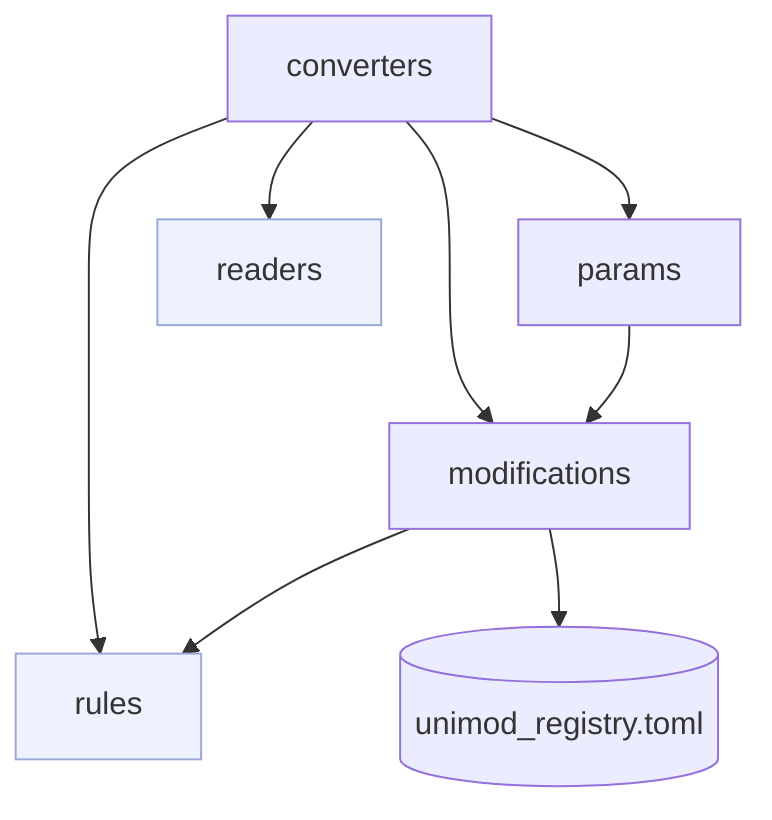
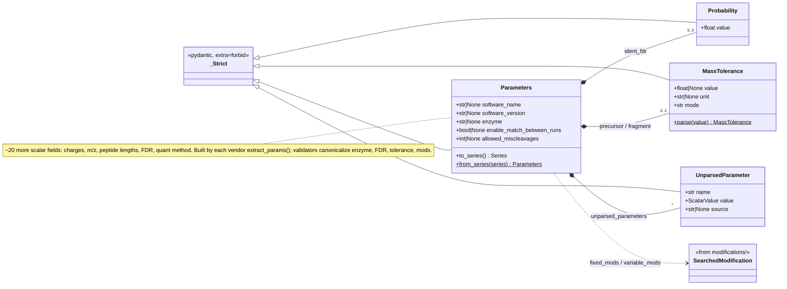
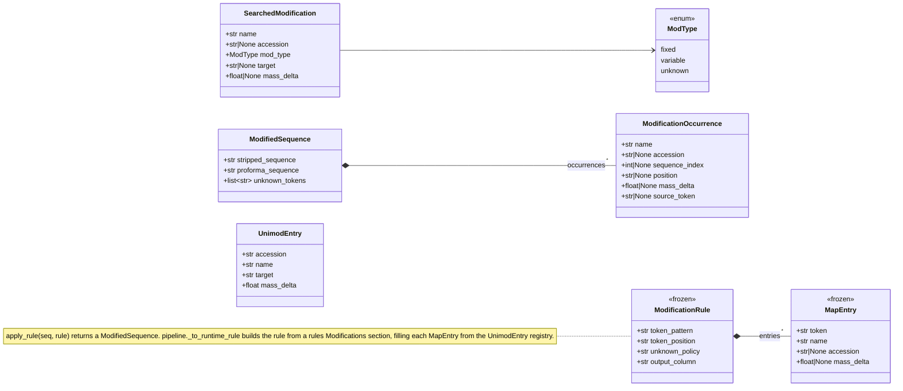
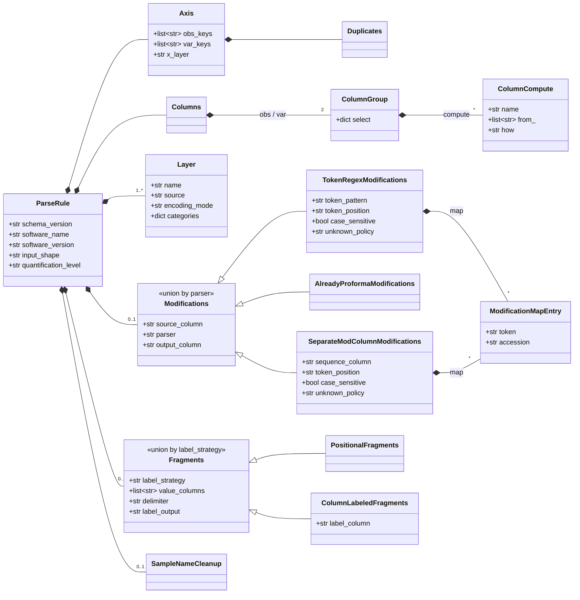
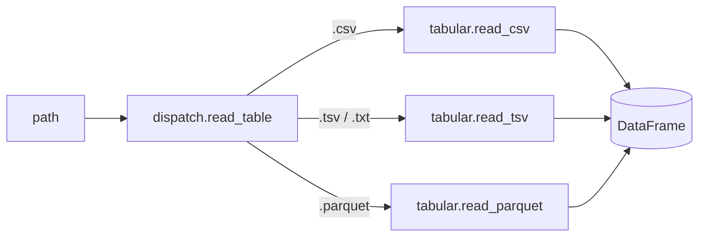
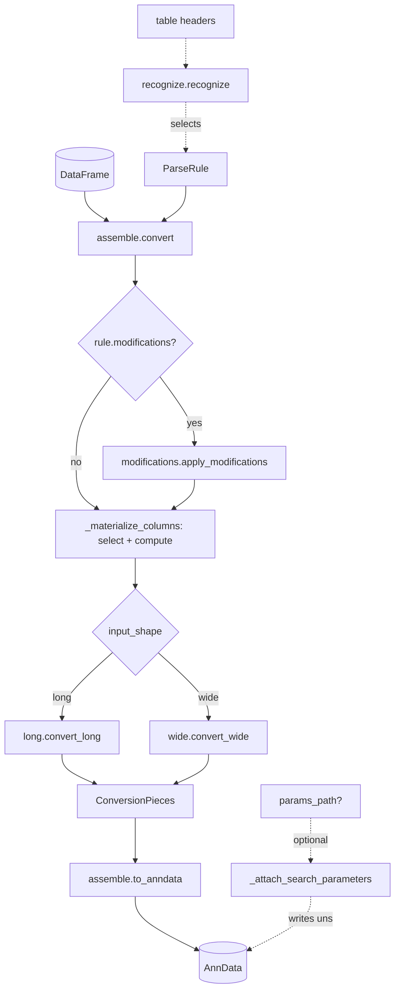
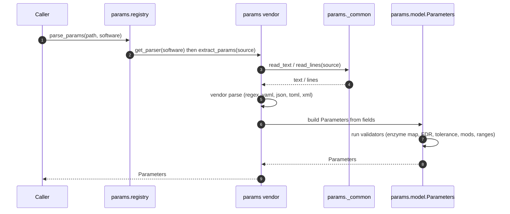
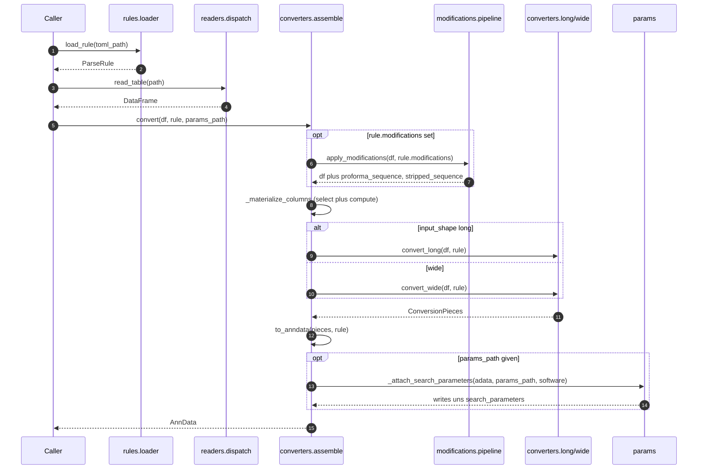

# Parsing architecture (UML)

The parsing subsystem lives under `src/anndata_proteomics/` and is split into five
subpackages. This doc gives a top-level dependency map, then **one diagram + a short
description per module**, then the two end-to-end flows that tie them together.

Two distinct "parsing" concerns to keep separate:

- **`params/`** parses a vendor **search-parameter file** (whole-experiment settings) into a
  typed `Parameters` record.
- **`modifications/`** parses **peptide modification strings** (a single sequence's mods) and
  models searched modifications for SDRF.

---

## Module dependency overview

Arrows mean **"imports / depends on"**. `rules` and `readers` are leaves; `converters` is the
orchestrator that pulls everything together.

| Module | One-line role |
|---|---|
| `params/` | Vendor parameter-file → typed `Parameters`. |
| `modifications/` | Vendor modified-sequence → ProForma + modification models. |
| `rules/` | The TOML parsing-rule schema (`ParseRule`) + its loader/registry. |
| `readers/` | Read a tabular quant file → `DataFrame`. |
| `converters/` | `DataFrame` + `ParseRule` → `AnnData`. |

---

## `params/` — vendor parameter-file parsing

**Parses a vendor search-parameter file into one typed `Parameters` record** — the model for
parameter-file parsing.

- **Inputs:** DIA-NN log/cfg, MaxQuant `mqpar.xml`, Sage JSON, AlphaPept / WOMBAT YAML,
  FragPipe `.workflow`, PEAKS / Spectronaut text, MSAID, MetaMorpheus.
- **Entry point:** each vendor module exposes `extract_params(source) -> Parameters`.
- **Dispatch:** `registry.py` looks up the parser by software name.
- **Reading:** `_common.py` centralizes file I/O (`read_text` / `read_lines`).
- **AnnData I/O:** `anndata_io.py` reads/writes a `Parameters` into `adata.uns`.

See [parameter_parsers.md](parameter_parsers.md) for the per-vendor breakdown (input formats,
parse techniques, and the three modification-mapping families).

---

## `modifications/` — modification-string parsing & models

**Normalizes peptide modifications** — modification identities/strings, distinct from `params/`
(whole-file settings). Two jobs:

- **ProForma normalization:** `apply_rules.apply_rule(seq, rule)` turns a vendor
  modified-sequence string (e.g. `PEPM(ox)TIDE`, `_[ac]PEP…`) into a canonical ProForma string
  plus localized `ModificationOccurrence`s. `pipeline.py` builds the `ModificationRule` from a
  rules `Modifications` section, resolving each `MapEntry` against the bundled `unimod_registry`.
- **Searched modifications:** `SearchedModification` models fixed/variable mods from parameter
  files, for SDRF export (`sdrf.py`).
- **Rendering:** `proforma.py` renders the ProForma string.

---

## `rules/` — the TOML parsing-rule schema

**Defines and loads the TOML parsing-rule schema** that tells the converters how to turn a
vendor table into AnnData. A leaf subpackage (imports no other subpackage).

- `schema.py` — the pydantic `ParseRule` (axis keys, column select/compute, layers, optional
  modifications section) with cross-field validation.
- `loader.py` — parse + validate a TOML file.
- `registry.py` — find packaged rules by `(software, level, version)`.
- `validate.py` — validate rule files.

---

## `readers/` — tabular file reading

**Reads a quant table into a pandas `DataFrame`.** A leaf subpackage.

- `tabular.py` — per-format readers (csv / tsv / parquet).
- `dispatch.read_table` — picks a reader by file extension.

---

## `converters/` — DataFrame + ParseRule → AnnData

**Turns a `DataFrame` + a `ParseRule` into an `AnnData`.**

- `assemble.convert` — orchestrates: optional modification normalization → column
  materialization → long/wide strategy → assemble.
- `long.py` / `wide.py` — the two shape strategies, each returning `ConversionPieces`.
- `assemble.to_anndata` — builds the `AnnData` (rule stored in `uns`).
- `recognize.py` — auto-picks a rule from table headers.
- When a `params_path` is given, parsed `Parameters` are attached to `uns`.

---

## End-to-end flows (cross-module)

### A. Vendor parameter file → `Parameters`

### B. Rule TOML + table → `AnnData` (+ optional params)

> Storage keys: the rule is saved in `uns['anndata_proteomics']['rule_json']`; parsed
> parameters in `uns['anndata_proteomics']['search_parameters']` (with the source path in
> `…['search_parameters_path']`).

---

This document is hand-maintained; when adding a vendor, model field, or rule section, update
the relevant module diagram above. Sources are under `src/anndata_proteomics/`.
