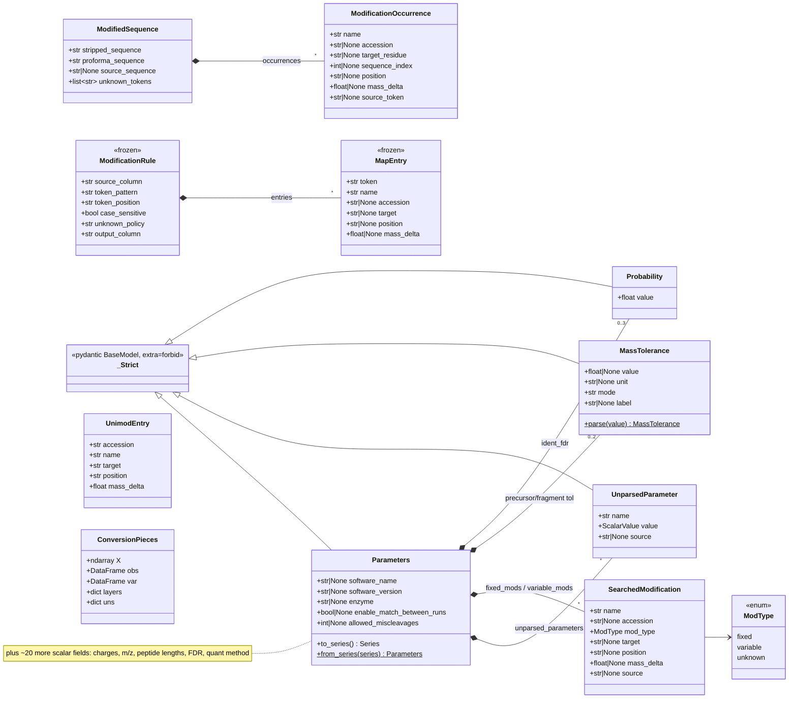
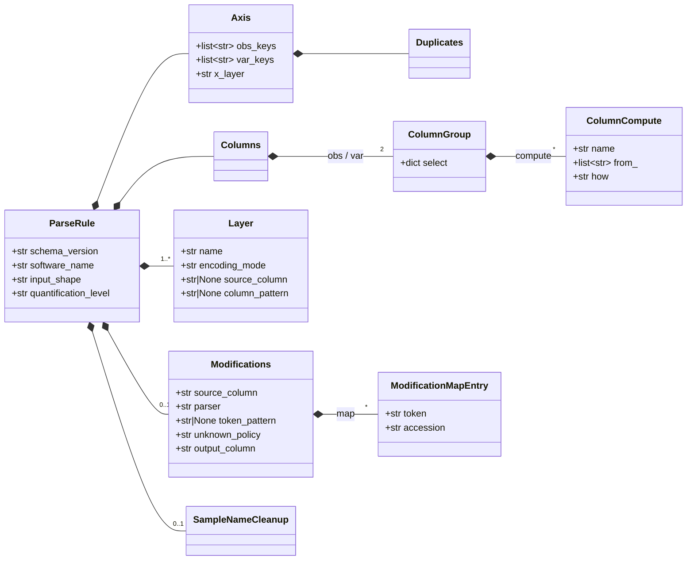
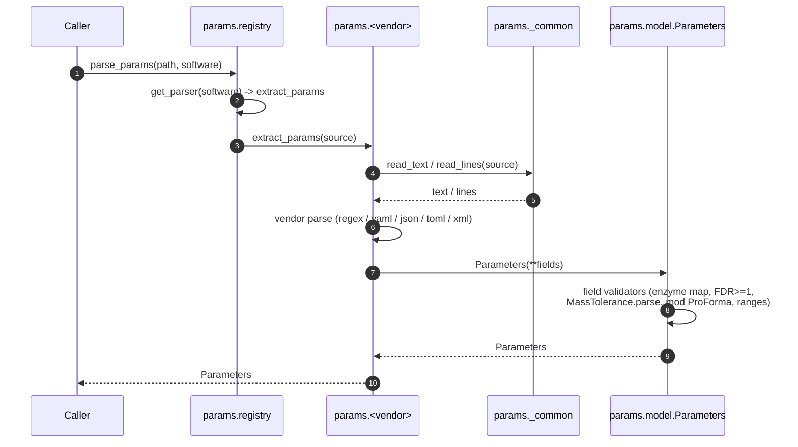
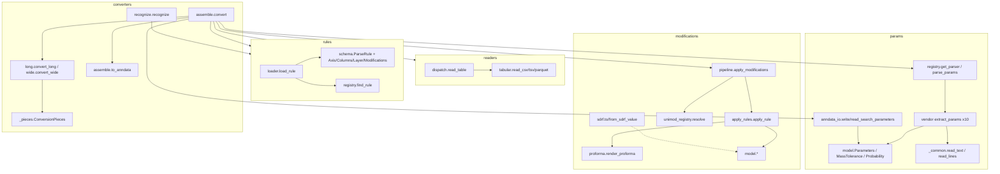

# Parsing architecture (UML)

Diagrams of APB's parsing subsystem, covering two related but distinct flows:

1. **Parameter parsing** — a vendor parameter file → a typed `Parameters` record.
2. **Table conversion** — a parsing-rule TOML + a vendor quant table → an `AnnData`
   (optionally attaching parsed search parameters into `uns`).

Diagrams are [Mermaid](https://mermaid.js.org/) and render in GitHub and most IDEs. Sources
referenced are under `src/anndata_proteomics/`.

---

## 1. Class diagram — data models

Three model families: **params** (`params/model.py`), **modifications**
(`modifications/model.py`, `apply_rules.py`, `unimod_registry.py`), and **rules**
(`rules/schema.py`), plus the `ConversionPieces` container.



The rule-schema models (`rules/schema.py`) compose as follows:



> `Parameters.fixed_mods/variable_mods` hold `SearchedModification` (defined in
> `modifications/model.py` but re-exported through `params` for SDRF use). The runtime
> `ModificationRule` (in `apply_rules.py`) is the resolved form of the TOML `Modifications`
> section — `modifications/pipeline._to_runtime_rule` fills each `MapEntry` from the
> `UnimodEntry` registry.

---

## 2. Flow — vendor parameter file → `Parameters`



## 2b. Flow — rule TOML + table → `AnnData` (+ optional params)

```mermaid
sequenceDiagram
    autonumber
    participant Caller
    participant Loader as rules.loader
    participant Reader as readers.dispatch
    participant Conv as converters.assemble.convert
    participant Mods as modifications.pipeline
    participant LW as converters.long/wide
    participant Asm as converters.assemble.to_anndata
    participant Params as params.registry + anndata_io

    Caller->>Loader: load_rule(toml) -> ParseRule
    Caller->>Reader: read_table(path) -> DataFrame
    Caller->>Conv: convert(df, rule, params_path=?)
    opt rule.modifications is not None
        Conv->>Mods: apply_modifications(df, rule.modifications)
        Mods->>Mods: _to_runtime_rule (unimod resolve) + apply_rule per row
        Mods-->>Conv: df + proforma_sequence / stripped_sequence
    end
    Conv->>Conv: _materialize_columns (select + compute)
    alt input_shape == long
        Conv->>LW: convert_long(df, rule) -> ConversionPieces
    else wide
        Conv->>LW: convert_wide(df, rule) -> ConversionPieces
    end
    Conv->>Asm: to_anndata(pieces, rule)
    Asm-->>Conv: AnnData (uns['anndata_proteomics']['rule_json'])
    opt params_path provided
        Conv->>Params: _attach_search_parameters(adata, params_path, software)
        Params->>Params: parse_params -> Parameters; write_search_parameters
        Note over Params: uns['anndata_proteomics']['search_parameters'(_path)]
    end
    Conv-->>Caller: AnnData
```

> Rule auto-detection: `converters.recognize.recognize(headers) -> ParseRule | None`
> picks the unique packaged rule whose `matches(headers, rule)` holds, when the caller
> doesn't supply a rule explicitly.

---

## 3. Package / component overview



---

## Notes

- `params/` is standalone (no `proteobench` imports); `extract_params(source) -> Parameters`
  is the uniform vendor entry point, dispatched via `params/registry.py`.
- Source acquisition is centralized in `params/_common.py` (`read_text` / `read_lines`);
  vendor modules only own the format-specific parse step.
- Parsed parameters live in `adata.uns['anndata_proteomics']['search_parameters']` (JSON), with
  the originating path in `…['search_parameters_path']`; the parsing rule is stored in
  `…['rule_json']`.
- This document is hand-maintained; when adding a vendor, model field, or rule section, update
  the relevant diagram above.
